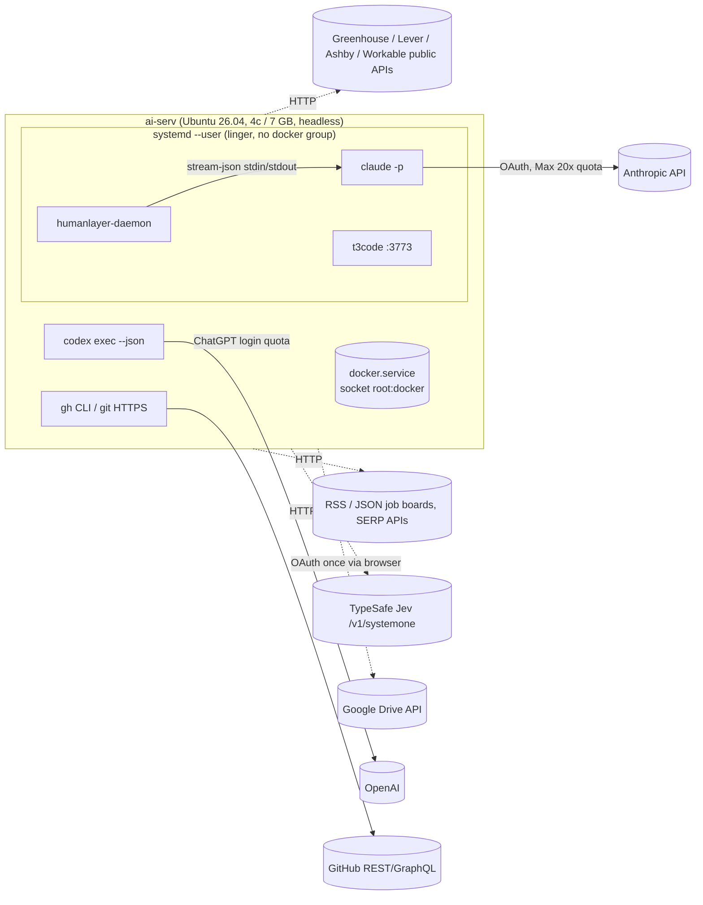

# Research: Foundations for a local job-search agent harness

**Date**: 2026-09-26T22:11:01+00:00
**Git Commit**: 671a27792c5ae2bb895509963a5f6a8c398bde5c
**Branch**: local-job-search-agent-harness-system-2vuidu
**Repository**: romirom11/applyant

## Research Question

1. What currently exists in the `applyant` repository (files, commits, `.gitignore`, any tooling config), and what does the host machine `ai-serv` provide as documented in `~/ops/README.md` — OS version, CPU/RAM/disk, installed runtimes (Python version, `uv`, Node, Docker + Compose), absence/presence of a native PostgreSQL, headless (no GUI) constraints, the systemd **user** service conventions (linger, `~/.config/systemd/user/`, PATH via `environment.d`), and how provider logins (`claude`, `codex`, `gh`) are handled on this machine?
2. How does the Claude Code CLI (`~/.local/bin/claude`) operate non-interactively: what do the `-p/--print` mode and `--output-format json|stream-json` emit (fields for result, session id, cost/usage, errors), how are structured outputs / JSON schemas, system prompts, allowed/disallowed tools, permission modes, MCP config, working directory, and session resume/continue controlled from the command line, what exit codes and failure modes exist (rate limits, auth expiry, timeouts), and how does authentication via a Claude subscription differ from API-key auth in terms of limits and concurrency? How does the Claude Agent SDK for Python relate to the CLI (does it wrap the same binary, what does it expose)?
3. How does the OpenAI Codex CLI (`@openai/codex`, installed globally via npm) run non-interactively via `codex exec`: what are its JSON/JSONL event output format, output-schema / last-message options, sandbox and approval-policy settings, model selection, session resume, config file (`~/.codex/config.toml`) and profiles, and how does ChatGPT-subscription login affect usage limits and parallel invocations?
4. What is Jev (TypeSafe AI's "System One" decision model) and how is it used: what SDK/API does it expose (Python package, HTTP API), how are decisions/choice sets declared (Pydantic types, closed enums, element indices), what inputs does it accept (e.g., numbered DOM element lists, text), what does a response look like (choice, probabilities/confidence), what are its pricing, latency, rate limits, auth model, and documented limitations?
5. What public job-posting APIs and page structures do the major ATS platforms expose — Greenhouse, Lever, Ashby, Workable? For each: endpoint shapes, returned fields, closed/archived behavior, application forms and custom questions, file upload fields, and captcha/anti-bot measures. Additionally, how is schema.org `JobPosting` JSON-LD used on company career pages?
6. What programmatic web-search options exist for discovering postings with operator queries like `site:jobs.ashbyhq.com "AI Engineer" Europe` — which support `site:` and quoted operators, what do results contain, and what are their pricing, quotas and ToS constraints? Also, what specialized/startup job boards offer RSS feeds or APIs?
7. How does Playwright for Python run on a headless Ubuntu server: installing browsers and system deps on Ubuntu 26.04, async API usage, persistent contexts/profiles, file uploads, ARIA snapshots and locator APIs for enumerating form fields, iframes, and memory footprint on a ~7 GB RAM machine?
8. How do PostgreSQL + pgvector + full-text search fit together: pgvector version and index types, distance operators, the Docker image, hybrid ranking (RRF) in plain SQL, Python async drivers and pgvector adapters, embedding-model options with dimensions? Also, what Postgres-backed job/task queue patterns and libraries exist for Python asyncio and how do they handle retries, timeouts and concurrency?
9. What does the GitHub API (REST and GraphQL) and `gh` CLI expose for extracting repository information, what are authenticated rate limits, and what are the trade-offs between API access and a local `git clone`? Similarly, how can Google Drive files and arbitrary URLs/PDFs be fetched and converted to text from Python?

## Research Methodology (verbatim)

This document will remain objective and factual. It does not contain any recommendations or implementation suggestions.
Open questions will not ask Why things haven't been built or what should be built in the future.

There is no "implementation" section - that is intentional.

## Summary

`applyant` is a greenfield repository: one commit containing a one-line `README.md`, plus an untracked `.gitignore` that only ignores `.humanlayer/tasks/`. There is no source code, no Python project metadata, no tests, no CI and no tooling config. Everything this research documents is therefore the **environment and the external interfaces** a harness would sit on: the `ai-serv` host (Ubuntu Server 26.04.1, 4 cores, 7.1 GiB RAM + 4 GiB swap, 100 GB free disk, Python 3.14.4, uv 0.12.19, Node 24, Docker 29.8 + Compose v5.5, no native PostgreSQL), two agent CLIs already logged in on subscriptions (Claude Code 2.1.283 on Claude Max 20x; Codex CLI 0.157.1 on a ChatGPT login), and `gh` 2.101 logged in as `romirom11`. One live host detail matters for anything containerised: the user-level systemd manager started before `romirom` joined the `docker` group, so processes descending from user services (including this agent session, spawned by `humanlayer-daemon`) do not carry the `docker` group and get `permission denied` on `/var/run/docker.sock`.

Both agent CLIs are built for being driven as subprocesses. Claude Code's `-p` mode emits either one JSON `result` object or an NDJSON stream (`system/init` → `assistant`/`user` → `result`) with `session_id`, `total_cost_usd`, `usage`, and — with `--json-schema` — a validated `structured_output`; the HumanLayer daemon on this machine already drives Claude exactly this way. Codex's `codex exec --json` emits a JSONL `thread.started`/`turn.*`/`item.*` stream and supports `--output-schema` plus `-o` for the final message. Both subscriptions meter usage on rolling 5-hour plus weekly windows shared with interactive use; neither documents a hard concurrency cap. Codex 0.157.1 has drifted from older docs: `--full-auto` is removed, `untrusted`/`on-failure` approval policies are gone, and profiles are now separate `<name>.config.toml` files.

Jev (TypeSafe AI, `jev-1.13.0`) is a hosted, **non-generative** text-only model reached via `POST https://api.typesafe.ai/v1/systemone` or the `typesafe-sdk` Python package: you send a `state` plus named questions of three types — `Choice` (≤255 named options), `Score` (2–10 ordered levels) and `Noul` (yes/no probability) — and get back probabilities/confidence, at $0.042 per million input tokens, 1,200 RPM, with a 64k-token request limit and a documented list of failure modes (math, dates, multi-hop, large noisy state, adversarial content). On the job-source side, all four ATSs expose unauthenticated read APIs with different shapes: Greenhouse also exposes full application-question schemas (`?questions=true`) and Ashby exposes structured workplace/compensation; Lever's public API does not expose custom questions; Workable's public surface is a widget endpoint. Closed postings disappear from list APIs everywhere. Every hosted apply page is protected: Greenhouse uses invisible reCAPTCHA with an emailed 8-character security-code fallback, Ashby uses reCAPTCHA, Workable uses Cloudflare Turnstile, and Lever uses hCaptcha (per community reports).

The remaining infrastructure pieces are mature and compatible with the host: Playwright 1.63.0 officially supports both Python 3.14 and Ubuntu 26.04 (since 1.61), with `aria_snapshot()` YAML and `frame_locator` for cross-origin ATS iframes; pgvector 0.8.6 ships as `pgvector/pgvector:pg18` and the canonical hybrid search is a single RRF CTE combining `ts_rank_cd` with `<=>`; asyncpg 0.31 and psycopg 3.2.10+ support Python 3.14; Procrastinate, PgQueuer, Chancy and SAQ provide `SKIP LOCKED`-based async queues. For discovery, Google Custom Search is closed to new customers (shutdown Jan 1 2027) and Bing's API is retired. Literal `site:` queries now go through SERP resellers (SerpAPI, Serper) or Brave, whose operator support is labelled experimental, while Exa and Tavily scope by domain parameters instead. Key-free job feeds exist mainly on remote-first boards. GitHub's REST/GraphQL limits are 5,000 requests or points per hour. Google Drive OAuth on a headless box has no browser-free official flow since OOB was removed.

## Detailed Findings

### 1. The repository is a blank slate on a small, headless, Docker-equipped host

#### The repo contains one commit and nothing executable

```text
applyant/                     (git worktree of ~/Developer/applyant, remote https://github.com/romirom11/applyant.git)
├── .git                      # worktree pointer → /home/romirom/Developer/applyant/.git/worktrees/applyant
├── .gitignore                # untracked; ignores only ".humanlayer/tasks/" (Riptide artifacts)
├── README.md                 # "# applyant" — the only committed file (commit 671a277 "Initial commit")
└── .humanlayer/tasks/…       # task artifacts (ignored)
```

There is no `pyproject.toml`, `uv.lock`, `docker-compose.yml`, source package, test directory, lint/format config or CI workflow. `~/ops/log.md` records how the repo came to be: it was an empty repo on branch `master`, the branch was renamed to `main`, a README commit was added, and a private `romirom11/applyant` was created and pushed so HumanLayer's `origin/main` preflight would pass (`~/ops/log.md:7-9`).

#### The host is a 4-core / 7 GB Ubuntu 26.04 box with Python 3.14 and Docker but no Postgres

Values below come from `~/ops/README.md:9-15` and were re-measured live on 2026-09-26.

| Resource | Value |
|---|---|
| OS | Ubuntu Server 26.04.1 LTS, kernel 7.0.0-34-generic, x86_64, **no GUI** |
| CPU / RAM / swap | 4 cores / 7.1 GiB total (≈5.3 GiB available at measurement) / 4 GiB swap |
| Disk | 116 GB `/dev/sda2`, 100 GB free |
| Python | system `python3` = **3.14.4** (`/usr/bin/python3.14`); it is the only interpreter uv reports as installed |
| uv | 0.12.19 at `~/.local/bin/uv` |
| Node / npm | v24.21.0 / 11.19.0; global prefix `~/.npm-global` |
| Docker / Compose | Docker 29.8.1, Compose plugin v5.5.1; `romirom` listed in the `docker` group |
| PostgreSQL | **Not installed natively** — no `psql`, no postgres packages, no postgres systemd unit |
| git / gh | git 2.53.0 / gh 2.101.0 |
| Network | LAN only (`10.10.0.100`), no Tailscale, ufw inactive (`~/ops/README.md:13-15`) |

#### Long-running things are systemd user services, and PATH is set in three places

The machine's convention is that user-level daemons run as systemd **user** services in `~/.config/systemd/user/`, with linger enabled so they survive logout and start on boot (`~/ops/README.md:52-57,72-74`). Two exist today: `humanlayer-daemon.service` (runs `humanlayer daemon launch`) and `t3code.service` (generated by `t3 service install`, listening on `127.0.0.1:3773`) (`~/ops/README.md:50-69`). Interactive agents run inside `tmux` (`~/ops/README.md:75`).

Because `claude` and `codex` live in `~/.local/bin` and `~/.npm-global/bin`, PATH is set in `~/.bashrc` (interactive), `~/.profile` (`sh -lc` login shells) and `~/.config/environment.d/10-path.conf` (systemd user services); the last currently reads `PATH=/home/romirom/.local/bin:/home/romirom/.npm-global/bin:/usr/local/sbin:…` (`~/ops/README.md:32-36`).

#### Processes under the user systemd manager do not have the docker group

`/etc/group` lists `docker:x:983:romirom`, but the group was added at 21:00:39 UTC. The user's `systemd --user` manager (pid 5689) started at 20:54:41 and its supplementary groups are `4 24 27 30 46 100 101 1000` (no 983). Everything launched from it inherits that list — `humanlayer-daemon` (started 21:24:07) and the `claude` sessions it spawns — so `docker ps` from this session fails with `permission denied while trying to connect to the docker API at unix:///var/run/docker.sock` (socket is `srw-rw---- root:docker`).

```text
systemd --user (pid 5689, started 20:54:41, groups without docker)
  humanlayer-daemon.service  (started 21:24:07)
    claude --output-format stream-json … (this research session)
      bash → docker ps → EACCES on /var/run/docker.sock
```

A process's supplementary groups are fixed when it is created. `user@1000.service` computes credentials through its PAM session (`PAMName=systemd-user`) only when the unit starts, and with linger it is "spawned … at boot and kept around after logouts" ([loginctl(1)](https://manpages.ubuntu.com/manpages/noble/en/man1/loginctl.1.html), [systemd.exec(5)](https://manpages.ubuntu.com/manpages/noble/en/man5/systemd.exec.5.html), [user@.service source](https://raw.githubusercontent.com/systemd/systemd/main/units/user%40.service.in)). The group list is therefore only re-read when that manager is re-created: by a reboot, by `sudo systemctl restart user@1000.service`, or by `loginctl terminate-user 1000` (logind then respawns the lingering manager, though that path has reported edge cases — [systemd#33488](https://github.com/systemd/systemd/issues/33488)). No documented mechanism hot-reloads groups in a running user manager.

#### Provider logins are interactive and done by the owner

`~/ops/README.md:76-77` states that `claude`, `codex login`, `gh auth login` and `humanlayer login` are done by the owner, not by agents. Their current state:

| Tool | Auth state observed (no secrets read) |
|---|---|
| Claude Code | OAuth in `~/.claude/.credentials.json`; `~/.claude.json` shows `billingType: stripe_subscription`, `organizationType: claude_max`, `organizationRateLimitTier: default_claude_max_20x`, `hasExtraUsageEnabled: false`, no API key |
| Codex CLI | `~/.codex/auth.json` with `auth_mode: "chatgpt"`; `~/.codex/config.toml` has only `[tui]` settings and one trusted project (`/home/romirom/for-test`) — no profiles and no MCP servers |
| gh | Logged in as `romirom11`; scopes `admin:public_key, gist, read:org, repo`. Global `git_protocol` is `https` and git uses `gh auth git-credential` as the credential helper for github.com, but the per-host entry in `~/.config/gh/hosts.yml` still says `git_protocol: ssh` (so `gh auth status` prints "ssh") |
| HumanLayer | Credentials from `humanlayer login`; `--launch-token` is deliberately not used because it expires in ~24 h (`~/ops/README.md:47-49`) |

#### Testing patterns

None — the repository has no tests, test runner config or CI.

### 2. Claude Code is a subprocess you drive over JSON — and this machine already does it

#### The HumanLayer daemon launches this very session as a streaming Claude subprocess

The live parent process of this research session is:

```text
~/.local/bin/claude --output-format stream-json --verbose --input-format stream-json \
  --max-thinking-tokens 31999 --thinking-display summarized --effort high --model opus \
  --permission-prompt-tool stdio --allowedTools Grep,Glob,Skill --tools Agent,…,WebFetch,Skill \
  --setting-sources=user,project,local --permission-mode bypassPermissions \
  --allow-dangerously-skip-permissions --include-partial-messages \
  --add-dir <plugin dirs> --plugin-dir <plugin dirs>
```

It shows the full-duplex mode: stdin carries NDJSON user messages (`--input-format stream-json`), stdout carries NDJSON events, `--tools` limits which built-in tools exist, `--allowedTools` pre-approves some of them, and `--permission-prompt-tool` names an MCP tool that answers permission prompts. `--max-thinking-tokens` is not in `claude --help` or the CLI reference; it is the argv form the Agent SDKs emit for the legacy `maxThinkingTokens` option ([sdk-python#1303](https://github.com/anthropics/claude-agent-sdk-python/issues/1303)).

#### `-p` emits one `result` contract, either alone (`json`) or at the end of an event stream (`stream-json`)

`--output-format` accepts `text` (default), `json` (a single result object) or `stream-json` (NDJSON; needs `--verbose`; `--include-partial-messages` adds raw `stream_event` deltas) ([headless](https://code.claude.com/docs/en/headless), [cli-reference](https://code.claude.com/docs/en/cli-reference)).

```text
stream-json event order
  {"type":"system","subtype":"init", session_id, model, tools, mcp_servers[{status,…}], plugins, permissionMode, …}
  {"type":"system","subtype":"api_retry", attempt, max_retries, retry_delay_ms, error}      (0..n)
  {"type":"assistant"|"user", message, parent_tool_use_id (null = main thread) }            (n)
  {"type":"stream_event", event:<raw API delta>}                                           (only with --include-partial-messages)
  {"type":"result", …}                                                                      (last line)
```

The `result` object is a union on `subtype`:

| Field | Meaning |
|---|---|
| `type`, `subtype` | `"result"`; `success` or `error_max_turns` / `error_during_execution` / `error_max_budget_usd` / `error_max_structured_output_retries` |
| `is_error` | `true` on every error subtype; can also be `true` on `success` if the final API call failed (see `api_error_status`) |
| `result` | final text (success only) |
| `structured_output` | schema-validated JSON (success only, when `--json-schema` is used) |
| `session_id`, `uuid` | session identity for `--resume` |
| `duration_ms`, `duration_api_ms`, `num_turns`, `stop_reason`, `terminal_reason` | run shape; `terminal_reason` ∈ `completed`, `max_turns`, `budget_exhausted`, `api_error`, `prompt_too_long`, … |
| `total_cost_usd`, `usage`, `modelUsage` | client-side cost **estimates**; `usage` covers only the top-level loop, `modelUsage` covers subagents too; resumed runs report cumulative totals |
| `permission_denials`, `errors[]` | denied tool calls; error messages on error subtypes |

Structured output is `--json-schema '<schema>'` (print mode only, draft-07 semantics, `format` not enforced). An invalid schema exits 1 with `Error: --json-schema is not a valid JSON Schema: …`; failure to satisfy it within the retry budget yields `subtype: error_max_structured_output_retries` ([structured outputs](https://code.claude.com/docs/en/agent-sdk/structured-outputs)).

#### The command line controls prompt, tools, permissions, MCP, sessions and budget

| Concern | Flags (confirmed in 2.1.283 `--help` and the CLI reference) |
|---|---|
| System prompt | `--system-prompt[-file]` (replace), `--append-system-prompt[-file]`, `--system-prompt-snapshot on\|off` |
| Tools | `--tools` (which built-ins exist: `""`, `default`, or a list); `--allowedTools` / `--disallowedTools` (rules such as `Bash(git diff *)`) |
| Permissions | `--permission-mode default\|acceptEdits\|plan\|auto\|dontAsk\|bypassPermissions`; `--dangerously-skip-permissions` = bypass; `--permission-prompts host\|none`; `--permission-prompt-tool <mcp tool>` |
| MCP | `--mcp-config <file/json…>`, `--strict-mcp-config` (only those servers) |
| Files / cwd | cwd is the process cwd; `--add-dir` grants extra directories (does not load their `.claude/` config except skills) |
| Model / effort | `--model opus\|sonnet\|haiku\|fable\|<id>`; `--effort low\|medium\|high\|xhigh\|max\|ultracode` |
| Settings | `--setting-sources user,project,local` |
| Sessions | `--resume/-r <id\|name>`, `--continue/-c`, `--session-id <uuid>`, `--fork-session` |
| Limits | `--max-turns` (→ `error_max_turns`), `--max-budget-usd` (→ `error_max_budget_usd`) |

#### Failures surface as exit codes, result subtypes and specific messages

| Failure | How it appears |
|---|---|
| Success | exit 0 |
| Config/startup errors (bad schema, missing cwd, …) | exit 1 with stderr; in-band failures in `-p` are printed as the `result` |
| SIGTERM | exit 143, turn left unfinished with no result |
| Auth expiry | `Failed to authenticate: OAuth session expired and could not be refreshed` (code `authentication_failed`); revoked `CLAUDE_CODE_OAUTH_TOKEN` → `OAuth token revoked · Please run /login`; no fallback credential |
| Subscription limits | `You've hit your session limit · resets 3:45pm`, `You've hit your weekly limit · resets …`, `You've hit your Opus limit` |
| Server throttling | `API Error: Server is temporarily limiting requests (not your usage limit)` — auto-retried, visible as `system/api_retry` events |
| Timeouts | default 10-min request timeout (`API_TIMEOUT_MS`, `CLAUDE_STREAM_FIRST_BYTE_TIMEOUT_MS`); background work at `-p` exit is waited on up to `CLAUDE_CODE_PRINT_BG_WAIT_CEILING_MS` (10 min) |

Source: [errors](https://code.claude.com/docs/en/errors), [env-vars](https://code.claude.com/docs/en/env-vars).

#### Subscription auth shares one rolling quota; API keys are the path for serving other people

On Pro/Max, usage is metered on a rolling **5-hour session window plus a weekly window**, shared across claude.ai, Cowork and Claude Code; Max 20x scales the session allowance 20× over Pro. A planned separate "Agent SDK credit" pool (announced May 2026) was **paused**, so `claude -p` and Agent SDK usage still draw from the subscription quota ([help center](https://support.claude.com/en/articles/15036540-use-the-claude-agent-sdk-with-your-claude-plan)). No per-plan concurrency cap is documented; parallel sessions just drain the same quota. `claude setup-token` prints a one-year OAuth token for `CLAUDE_CODE_OAUTH_TOKEN` (model requests only; not read in `--bare` mode). Anthropic's legal page describes subscription OAuth as intended for the purchaser's ordinary use of Claude Code; routing other users' traffic through it or offering claude.ai login in another product is not permitted, and API keys are the documented route for products serving others ([legal-and-compliance](https://code.claude.com/docs/en/legal-and-compliance)).

#### The Python Agent SDK is a typed wrapper around the same binary

`claude-agent-sdk` (Python ≥3.10) "runs the Claude Code binary". It bundles a native binary per platform and otherwise falls back to `claude` on PATH, so it uses the same credential precedence as the CLI, including subscription OAuth ([overview](https://code.claude.com/docs/en/agent-sdk/overview), [python reference](https://code.claude.com/docs/en/agent-sdk/python)).

```python
query(prompt, options=ClaudeAgentOptions(...)) -> AsyncIterator[Message]   # new session per call unless resume
ClaudeSDKClient(options)  # persistent session; .query(), .receive_response(), .interrupt()
ClaudeAgentOptions(system_prompt, allowed_tools, permission_mode, mcp_servers, resume, fork_session,
                   max_turns, max_budget_usd, output_format={"type":"json_schema","schema":…}, hooks, agents, …)
@tool(name, description, input_schema) + create_sdk_mcp_server(name, version, tools=[…])  # in-process MCP tools → "mcp__<server>__<tool>"
```

#### Testing patterns

Not applicable (external tool); no local test harness exists for CLI invocation.

### 3. Codex runs as `codex exec` with a JSONL thread/turn/item stream, and 0.157.1 has dropped several older flags

#### `codex exec --json` emits lifecycle events and typed items

The prompt comes from an argument, from stdin (`codex exec -` or no argument), or both: stdin is then appended as a `<stdin>` block. Progress goes to stderr and the final message to stdout ([non-interactive mode](https://learn.chatgpt.com/docs/non-interactive-mode)).

```text
{"type":"thread.started","thread_id":"0199a213-…"}
{"type":"turn.started"}
{"type":"item.started"|"item.completed","item":{"id":"item_1","type":<item type>, …, "status":"in_progress"|"completed"}}
    item types: agent_message{text} · reasoning{text} · command_execution{command, aggregated_output, exit_code}
                file_change{changes[{path,kind}]} · mcp_tool_call{server, tool, arguments, result} · todo_list{items} · error
{"type":"turn.completed","usage":{"input_tokens":…, "cached_input_tokens":…, "output_tokens":…}}
{"type":"turn.failed","error":{"message":"…"}}   |   {"type":"error","message":"stream error: …"}
```

`--output-schema <file>` constrains the final response to a JSON Schema (OpenAI strict mode: `additionalProperties: false`, all properties `required`), and `-o/--output-last-message <file>` writes the final message to a file ([cheatsheet](https://takopi.dev/reference/runners/codex/exec-json-cheatsheet/)).

#### Sandbox, approvals, profiles and sessions in 0.157.1

| Area | Current behaviour (local `--help` + docs) |
|---|---|
| Sandbox | `-s read-only\|workspace-write\|danger-full-access`; `codex exec` defaults to **read-only**; `-c sandbox_workspace_write.network_access=true` enables network |
| Approvals | `on-request` and `never` only (plus a `granular` object form in config). `untrusted` is unsupported and `on-failure` deprecated. `codex exec` has no `-a` flag, only `approval_policy` in config |
| Removed | `--full-auto` removed in v0.147.0 (2026-08-07); replacement is `--sandbox workspace-write` (+ `never`) ([PR #20133](https://github.com/openai/codex/pull/20133)) |
| Escape hatches | `--approve-for-me` (auto-review under workspace-write); `--dangerously-bypass-approvals-and-sandbox` |
| Workspace | `-C/--cd`, `--add-dir`, `--worktree`, `--skip-git-repo-check` (exec otherwise exits 1 outside a git repo), `--ephemeral` (don't persist) |
| Model | `-m`, `-c model_reasoning_effort=…`, `--oss`/`--local-provider ollama\|lmstudio` |
| Profiles | Since 0.134, `[profiles.x]` tables are gone; `-p/--profile <name>` layers `$CODEX_HOME/<name>.config.toml` |
| Overrides | `-c dotted.key=<toml>` (repeatable), `--enable/--disable <feature>` |
| MCP | `[mcp_servers.<id>]` in `config.toml` (`command`, `args`, `env`, timeouts, `enabled_tools`), or `codex mcp add/list/get/remove/login` |
| Resume | `codex exec resume --last` or `codex exec resume <id\|name>`; also `codex fork`, `codex queue`. State lives in SQLite under `~/.codex/` (`state_5.sqlite`, `queue_1.sqlite`, …); there is no `sessions/` directory on this host |
| Diagnostics | `codex doctor [--json]` |

Exit codes are documented only as non-zero on failure. Usage-limit exhaustion currently exits 1 with `You've hit your usage limit … try again at [time]`, which is not distinguishable from other failures ([issue #30041](https://github.com/openai/codex/issues/30041)).

#### ChatGPT login draws from the plan's 5-hour/weekly token windows

With `auth_mode: chatgpt`, local CLI and cloud tasks share the plan allowance, which is metered by tokens (since about April 2026) on a rolling 5-hour window plus a weekly cap. Published per-plan ranges vary widely by model tier, and `/status` in the CLI shows the current numbers. `CODEX_API_KEY` / `OPENAI_API_KEY` switches to metered API billing and takes precedence over a ChatGPT session, and `CODEX_ACCESS_TOKEN` is documented for "trusted automation" ([auth](https://learn.chatgpt.com/docs/auth), [env vars](https://learn.chatgpt.com/docs/config-file/environment-variables)). No concurrency cap for parallel `exec` processes is documented.

#### Programmatic wrappers exist around the same JSONL protocol

The official TypeScript SDK `@openai/codex-sdk` (`new Codex().startThread().run(prompt)`) spawns the CLI and speaks the exec JSONL protocol. The official Python package is **`openai-codex`** (v0.157.1, same version as the CLI; `pip install openai-codex`; `Codex`/`AsyncCodex`, `Sandbox` enum). Its PyPI project URLs point to `openai/codex` `sdk/python`, and developers.openai.com/codex/sdk references it. A similarly named `openai-codex-sdk` (v0.1.11) is maintained by an individual PyPI account (`tomasroda`), has no repository link, and is not referenced by OpenAI's docs ([openai-codex](https://pypi.org/project/openai-codex/), [Codex SDK](https://developers.openai.com/codex/sdk)). `codex mcp-server` exposes Codex as a stdio MCP tool. `codex app-server` is a richer JSON-RPC daemon (stdio / unix / ws transports) with `generate-ts` / `generate-json-schema` for typed clients ([codex-sdk](https://learn.chatgpt.com/docs/codex-sdk)).

#### The two CLIs line up closely

| Capability | Claude Code 2.1.283 | Codex CLI 0.157.1 |
|---|---|---|
| Headless entry | `claude -p` | `codex exec` |
| Machine output | `--output-format json\|stream-json` (NDJSON) | `--json` (JSONL) |
| Final structured output | `--json-schema` → `result.structured_output` | `--output-schema` → final `agent_message` / `-o` file |
| Session id | `session_id` in init/result | `thread_id` in `thread.started` |
| Resume | `--resume <id>`, `--continue`, `--fork-session` | `exec resume <id>\|--last`, `fork` |
| Cost/usage | `total_cost_usd`, `usage`, `modelUsage` | `turn.completed.usage` (tokens only) |
| Tool restriction | `--tools`, `--allowedTools`, `--disallowedTools` | sandbox mode + `approval_policy` + MCP `enabled_tools` |
| Turn/budget caps | `--max-turns`, `--max-budget-usd` | none documented as flags |
| Limit signal | distinct messages + `api_retry` events | generic exit 1 |
| Python wrapper | `claude-agent-sdk` | `openai-codex` (official) |

#### Testing patterns

Not applicable (external tool).

### 4. Jev is a hosted text classifier that answers typed questions with probabilities, not text

#### A request is a `state` plus named questions of exactly three primitive types

Jev is TypeSafe AI's "System One" model, built for fast typed decisions rather than generation ([system-one](https://docs.typesafe.ai/concepts/system-one)). Its docs state it is not a drop-in replacement for the LLM behind coding agents and is not trained to generate text ([coding agents](https://docs.typesafe.ai/introduction/coding-agents)).

```text
POST https://api.typesafe.ai/v1/systemone
Authorization: Bearer $TYPESAFE_API_KEY
{ "state": <string | JSON object | array of text>,
  "model": "jev-latest",
  "questions": { "<your id>": { "type": "choice"|"score"|"noul", "instructions": "...", "criteria": ... } } }
→ { "answers": { "<id>": <answer> }, "usage": {input_tokens, output_tokens}, "model": "jev-1.13.0" }
```

| Primitive | `criteria` | Answer |
|---|---|---|
| `Choice` | map of named options → description, **≤255 options** | `{choice, confidence, probabilities{option: p}}` |
| `Score` | ordered list of 2–10 level descriptions | `{score (fractional, e.g. 1.43), confidence, legend, probabilities{level: p}}` |
| `Noul` | optional `{true, false}` clarifications | `{noul: 0.0–1.0}` (no separate confidence) |

The Python SDK `typesafe-sdk` (Python ≥3.10, `uv add typesafe-sdk`) exposes `TypeSafeClient` / `AsyncTypeSafeClient.system_one(state, questions, response_model=…)`. Question classes `Choice`/`Score`/`Noul` look like Pydantic models, and a `SystemOneResponse` subclass (or any Pydantic model) gives typed answers. SDKs retry `429`/`529` honouring `retry-after`. Other errors are `401` and `422` ([API](https://docs.typesafe.ai/api), [SDK usage](https://docs.typesafe.ai/sdk/python/usage)).

```python
async with AsyncTypeSafeClient() as client:
    r = await client.system_one("I was charged twice. Please help ASAP.", {
        "billing": Noul(instructions="Is this about billing?"),
        "tone": Choice(instructions="What is the tone?", criteria={"calm": None, "angry": None}),
        "urgency": Score(instructions="How urgent is this?", criteria=["low", "medium", "high"]),
    })
    r.nouls["billing"].noul, r.choices["tone"].choice, r.scores["urgency"].score
```

Instructions and criteria can be structured objects that point into nested `state` fields with backtick paths (`` `ticket.messages[0].text` ``) ([advanced](https://docs.typesafe.ai/primitives/advanced)). The docs describe **no DOM-element or index primitive**; an indexed list of options would have to be expressed as `Choice` option names.

#### Inputs are text-only, English-first, and capped at 64k tokens per request

`state` accepts text or JSON only: "Images, audio, and video are not supported (yet)" ([state](https://docs.typesafe.ai/concepts/state)). A request can carry 64k tokens in total, with at most 32k for state plus the longest single question. Questions are evaluated in parallel, so adding more barely changes latency. English performs best, and other languages are accepted but weaker ([models](https://docs.typesafe.ai/models)).

| Model fact (`jev-1.13.0`, aliases `jev-latest`, `jev-preview`) | Value |
|---|---|
| Price | $42 per **billion** input tokens; output free |
| Rate limits | 250,000 tokens/s, 1,200 requests/min (may change without notice) |
| Latency | not published as an SLA; TypeSafe blog says 70–500 ms; the dev.to benchmark measured a median of ≈0.3 s |
| Customisation | none — same weights for all accounts, no fine-tuning |
| Data | not trained on customer data; ZDR for enterprise |
| Other gateways | Cloudflare AI, OpenRouter (`typesafe/jev-1.13`), Vercel / Netlify AI gateways via `TYPESAFE_BASE_URL` |

#### TypeSafe documents nine failure modes; an independent benchmark shows where it works

The official "jaggedness" page (reviewed 2026-09-17) lists these failure modes: literal reading; math and counting; date/time comparison; multi-hop indirection; large irrelevant state; adversarial content (state is trusted by default); contradictory criteria; non-comparable Noul vs binary Choice (e.g., 0.22 vs 0.01 on the same question); and text generation ([jaggedness](https://docs.typesafe.ai/model-jaggedness/jev-1.13)).

| Benchmark task ([dev.to](https://dev.to/aitejiu/benchmarking-jev-what-a-decision-model-can-and-cant-do-in-an-agent-harness-20po)) | Result |
|---|---|
| Prompt-injection detection (InjecAgent, 1,105) | 100% P/R at threshold 0.10 (but 16.6% of the 0–0.1 bucket still malicious) |
| Reranking (SciFact) | MRR 0.622 → 0.843 |
| Intent classification | SNIPS 97.9%, Banking77 80.3% |
| Tool routing (199 tools) | 96.5% |
| Shell-command risk gate | 100% dangerous caught, 98.2% safe passed |
| Skill routing | 75.8% R@1 (81.0% with "compete then verify") |
| Model-difficulty routing | 51% — no signal |
| Trajectory failure attribution | AUROC 0.560 — ≈ random |
| Korean vs English | 48.9% vs 61.5% R@1 |
| Whole benchmark cost | $2.19 for 22,500 calls / 52.2M tokens |

The LangChain post and `langchain-typesafe` (alpha 0.0.1a3: `TypeSafeClassifier`, `ModelRouterMiddleware`, `AutoModeMiddleware`) describe the same division of labour: a generative LLM reasons and writes, and Jev makes routing and gating decisions at fixed points ([LangChain blog](https://www.langchain.com/blog/building-a-harness-with-jev)). The SitePoint tutorial instead uses a `pip install jev` / `from jev import Decision` package that wraps an OpenAI LLM for Pydantic-constrained JSON. It does not match TypeSafe's API, and the article itself hedges that the package may not exist as shown ([SitePoint](https://www.sitepoint.com/build-safer-ai-agent-harness-jev-langchain/)).

#### Testing patterns

Not applicable (external service).

### 5. The four ATSs expose unauthenticated read APIs with very different field coverage

#### Endpoints and fields differ per platform

| | Greenhouse | Lever | Ashby | Workable |
|---|---|---|---|---|
| Public list endpoint | `GET boards-api.greenhouse.io/v1/boards/{token}/jobs[?content=true]` | `GET api.lever.co/v0/postings/{site}?mode=json` (EU: `api.eu.lever.co`) | `GET api.ashbyhq.com/posting-api/job-board/{name}?includeCompensation=true` | `GET apply.workable.com/api/v1/widget/accounts/{sub}[?details=true]` |
| Single job | `/jobs/{id}` (+`?questions=true`, `&pay_transparency=true`) | `/v0/postings/{site}/{id}` | none public (auth `jobPosting.info`) | auth v3 `/spi/v3/accounts/{acct}/jobs/{shortcode}` |
| Hosted pages | `boards.greenhouse.io/{token}`, `job-boards.greenhouse.io/{token}` | `jobs.lever.co/{site}` | `jobs.ashbyhq.com/{name}` | `apply.workable.com/{slug}` |
| ID / title | `id`, `title`, `requisition_id` | `id`, `text` | (no id in public payload; `jobUrl`), `title` | `shortcode`, `title` |
| Location | `location.name`, `offices[]` | `categories.location`, `allLocations`, `country` | `location`, `secondaryLocations[]`, `address.postalAddress` | location object + `locations[]` |
| Remote/workplace | **none** (free text only) | `workplaceType` on-site/remote/hybrid/unspecified | `isRemote`, `workplaceType` OnSite/Remote/Hybrid | `workplace_type`, `telecommuting` |
| Employment type | none | `categories.commitment` | `employmentType` FullTime/PartTime/Intern/Contract/Temporary | (v3) |
| Compensation | `pay_input_ranges` (min/max cents, currency) with `pay_transparency=true` | `salaryRange{currency, interval, min, max}`, `salaryDescription` | `compensation.compensationTiers[].components[]` | `salary_from/to/currency` (v3) |
| Description | `content` (HTML) | `description[Plain]`, `lists[]`, `additional[Plain]` | `descriptionHtml`, `descriptionPlain` | `description`, `full_description` |
| Dates | `updated_at`, `first_published` | **none** | `publishedAt` | `created_at`, `updated_at` (v3) |
| Apply URL | `absolute_url` | `hostedUrl`, `applyUrl` | `applyUrl` | `application_url` |

Sources: [Greenhouse Job Board API](https://docs.greenhouse.io/job-board.html), [Lever postings-api](https://github.com/lever/postings-api/blob/master/README.md), [Ashby posting API](https://developers.ashbyhq.com/docs/public-job-posting-api), [Workable widget writeup](https://dev.to/zsevic/integration-with-workable-public-jobs-api-3nk4), [Workable v3 jobs](https://workable.readme.io/reference/jobs).

#### Closed postings vanish from APIs; hosted pages vary

All four public list APIs return only published postings, so a closed job simply drops out. Greenhouse single-job GETs are reported to return 404 once unpublished, while the hosted page shows "This job is no longer accepting applications". Lever's public API hides every non-published state, and the hosted URL may show a "redirected here by mistake" page. Ashby has no public closed flag. Workable jobs move `published → closed → archived` in v3 `state`.

#### Only Greenhouse exposes the full application form publicly

```text
GET /v1/boards/{token}/jobs/{id}?questions=true
  questions[]:            { required, label, fields[{ name, type, values? }] }
                          type ∈ input_text | input_file | input_hidden | textarea |
                                 multi_value_single_select | multi_value_multi_select
                          e.g. "Resume" = fields [resume (input_file), resume_text (textarea)]
  location_questions[]:   location (text) + latitude/longitude (hidden, Google Places)
  compliance[]:           EEOC (gov contractors)
  demographic_questions:  { header, description, questions[{ id, label, required, type, answer_options[{id,label,free_form}] }] }
  data_compliance[]:      GDPR consent (requires_consent, retention_period…)
```

Greenhouse's POST apply endpoint requires the employer's API key (Basic auth), accepts resumes as multipart, base64, URL or plain text (pdf/doc/docx/txt/rtf), and does **not** validate required fields server-side ([applications](https://github.com/grnhse/greenhouse-api-docs/blob/master/source/includes/job-board/_applications.md)). Lever's public API explicitly does **not** expose custom questions. Its keyed apply POST takes `name`, `email`, `resume` (multipart), `urls`, `consent`, and more, rate-limited to 2 req/s. Ashby's form (`applicationFormDefinition.fields[{field{path,type,title}, isRequired}]`, types `String|Email|File|Date|Number|Boolean|LongText|ValueSelect|MultiValueSelect|Phone|Score|SocialLink`) and its `applicationForm.submit` / presigned `file.createFileUploadHandle` flow require the employer's API key. Workable questions (`/jobs/{shortcode}/questions`: yes/no, dropdown, multiple choice, date, number, upload) are likewise v3-authenticated.

#### Hosted apply flows carry bot defences and embed via iframes/scripts

| | Anti-bot on hosted apply | Embed on career sites |
|---|---|---|
| Greenhouse | Invisible reCAPTCHA (Enterprise); suspicious submissions get an emailed **8-character security code** step ([support](https://support.greenhouse.io/hc/en-us/articles/115005448066-Invisible-reCAPTCHA)) | `<div id="grnhse_app">` + `boards.greenhouse.io/embed/job_board/js?for={token}` (iframe) |
| Lever | hCaptcha (community reports from automation projects) | `?mode=iframe` for the **list only**; no iframe for detail/apply |
| Ashby | **Google reCAPTCHA** — live `…/application` pages embed `recaptchaPublicSiteKey` (`6L…`) and a reCAPTCHA badge; not part of the `applicationForm.submit` API contract | `<div id="ashby_embed">` + `jobs.ashbyhq.com/{slug}/embed?version=2` (Ashby-managed iframe; full board or form-only) |
| Workable | **Cloudflare Turnstile** — live `…/apply/` pages carry `"recaptcha":false`, `"wjb_acp_turnstile_captcha_enabled":true`, `turnstileWidgetSiteKey` (`0x4AAAAAAA…`) | widget uses the same widget JSON; markup is generated per account in Settings → Integrations ([help](https://help.workable.com/hc/en-us/articles/115012801727-How-to-embed-jobs-on-your-website-job-widget)) |

Lever runs two separate deployments. EU-resident customers are served from `jobs.eu.lever.co/{site}` and `api.eu.lever.co/v0/postings/{site}`, and querying a site on the wrong host returns 404 or an empty list. The hosted-page domain therefore identifies the instance. Lever's prose docs don't state this explicitly; it is corroborated by live boards (e.g., [jobs.eu.lever.co/lever](https://jobs.eu.lever.co/lever)) and third-party integrations that fall back between hosts ([example PR](https://github.com/begindtheseen/Seen/pull/296)).

#### schema.org `JobPosting` is Google-for-Jobs markup with explicit expiry rules

Google requires `title`, `description`, `datePosted`, `hiringOrganization` and `jobLocation`. `jobLocation` may be replaced by `jobLocationType: "TELECOMMUTE"` plus `applicantLocationRequirements`. Recommended fields are `validThrough`, `employmentType` (`FULL_TIME`, `CONTRACTOR`, …), `baseSalary`, `identifier` and `directApply`. For expired jobs, a page must set a past `validThrough`, return 404/410, or remove the markup. Leaving live markup is a "JobPosting structured data on expired job" policy violation ([Google](https://developers.google.com/search/docs/appearance/structured-data/job-posting)). Ashby's authenticated `jobPosting.info` returns a ready-made `linkedData` JSON-LD object.

#### Testing patterns

Not applicable (external APIs).

### 6. Literal `site:` search now lives with SERP resellers, and open job feeds cluster on remote boards

#### The two first-party open-web search APIs are gone or closing

Google Custom Search JSON API is closed to new customers, and existing customers must migrate by **2027-01-01**. Its suggested successor, Vertex AI Search, searches an organisation's own content ([overview](https://developers.google.com/custom-search/v1/overview)). The Bing Web Search API was retired on **2025-08-11**. "Grounding with Bing" returns context to an Azure agent, not SERP JSON ([Microsoft](https://learn.microsoft.com/en-us/lifecycle/announcements/bing-search-api-retirement)).

| Provider | `site:` / `"quotes"` | Domain/date controls | Free tier | Paid |
|---|---|---|---|---|
| SerpAPI | native (proxies Google/Bing) | Google `tbs` | 250/mo | from $25/mo per 1K |
| Serper.dev | inline in `q` | `tbs=qdr:*`, `cdr` ranges | 2,500 one-time | ~$0.30–1 per 1K (prepaid credits) |
| Brave Search API | yes, inline in `q`: `site:`, `"…"`, `-`, `intitle:`, `filetype:`, `lang:`, `loc:`, `AND/OR/NOT` — labelled "experimental" ([operators](https://api-dashboard.search.brave.com/documentation/resources/search-operators)) | `freshness=pd\|pw\|pm\|py` or `YYYY-MM-DDtoYYYY-MM-DD` | 2,000/mo, 1 QPS | $5/1K; result storage needs a plan with storage rights |
| Exa | no `site:`; `includeDomains`/`excludeDomains` (≤1,200), neural retrieval | published-date range | $10/mo credit | $7/1K |
| Tavily | quoted phrases supported; domain include/exclude params | date params | 1,000 credits/mo | $0.005–0.008/credit |
| Kagi | undocumented pass-through | — | — | $12/1K |
| Jina `s.jina.ai` | `site:` documented | — | — | — |
| Firecrawl `/v2/search` | "query operators" | `tbs=qdr:*` | — | — |
| SearXNG (self-hosted) | passes through to upstream engines | upstream | free | hosting only; JSON format off by default |
| DuckDuckGo (unofficial `ddgs`) | pass-through | — | free | ToS prohibits automated use |

#### Key-free job feeds exist mostly for remote-first boards

| Source | Access | Terms |
|---|---|---|
| HN "Who is hiring" | `hn.algolia.com/api/v1/search[_by_date]`, `/items/:id` (comments need parsing) | no key |
| RemoteOK | `remoteok.com/api` (salary_min/max, tags, apply_url) | **must** backlink and credit RemoteOK |
| We Work Remotely | `weworkremotely.com/remote-jobs.rss` and per-category RSS | — |
| Remotive | `remotive.com/api/remote-jobs` (+ RSS) | may throttle |
| Himalayas | `himalayas.app/jobs/api[/search]` (seniority, salary, timezone, expiryDate); MCP + RSS | 429s; refresh daily; **must** backlink |
| Arbeitnow | `arbeitnow.com/api/job-board-api` (ATS-sourced, EU-heavy, `remote` flag) | — |
| Jobicy | API with `count≤200`, `geo`, `industry`, `tag` | poll ≤ hourly |
| Landing.jobs | JSON API (jobs/companies unauthenticated) | — |
| Wellfound, YC Work at a Startup, Welcome to the Jungle (Otta), relocate.me, hiring.cafe | **no first-party API**; third-party Apify scrapers only | — |
| EuroTechJobs, berlinstartupjobs | no API/RSS found (berlinstartupjobs feed reported stale) | — |
| LinkedIn, Indeed | no jobs-search API for this use | ToS prohibit scraping |

#### Testing patterns

Not applicable (external services).

### 7. Playwright 1.63 supports this exact host; browser contexts are cheap and browsers are not

#### Version support lines up with Ubuntu 26.04 and Python 3.14

Playwright for Python **1.63.0** (2026-09-15) declares `requires-python >=3.10` with a 3.14 classifier ([pyproject](https://github.com/microsoft/playwright-python/blob/main/pyproject.toml)). Ubuntu 26.04 support shipped in **1.61** (2026-06-29) after [issue #40117](https://github.com/microsoft/playwright/issues/40117), so `playwright install --with-deps` recognises this OS. Before 1.61 it failed with "Cannot install dependencies for ubuntu26.04-x64". `--only-shell` installs only `chromium-headless-shell` (the default headless browser). The `chromium` channel uses Chrome's "new headless" mode and pairs with `--no-shell` ([browsers](https://playwright.dev/python/docs/browsers)). The official image is `mcr.microsoft.com/playwright/python:v1.63.0-noble` (Ubuntu 24.04 base, browsers included, pip package not included). Its docs recommend `--init` and `--ipc=host` and describe it as not intended for untrusted sites ([docker](https://playwright.dev/python/docs/docker)).

#### The async API and state persistence

```python
async with async_playwright() as p:
    browser = await p.chromium.launch()                     # one browser process
    ctx = await browser.new_context(storage_state="state.json")   # cheap, isolated cookie jar
    page = await ctx.new_page()
    await ctx.storage_state(path="state.json")              # cookies, localStorage, IndexedDB (+ OPFS in 1.63)
ctx = await p.chromium.launch_persistent_context(user_data_dir, headless=True)  # on-disk profile; one process per dir
```

The API is not thread-safe, so concurrency means `asyncio.gather` over contexts and pages. Cancelling a task mid-call is undefined behaviour, and the docs point to `asyncio.shield` ([library](https://playwright.dev/python/docs/library), [auth](https://playwright.dev/python/docs/auth)).

#### Forms can be read through ARIA snapshots and role/label locators, including inside cross-origin iframes

- **Uploads**: `locator.set_input_files(path | [paths] | {name, mimeType, buffer})`; `page.expect_file_chooser()` handles dynamically created inputs ([input](https://playwright.dev/python/docs/input)).
- **ARIA**: `locator.aria_snapshot()` returns YAML lines such as `- textbox "Email" [disabled]`. Documented attributes are `checked`, `disabled`, `expanded`, `invalid`, `level`, `pressed`, `selected`; the `boxes` option adds `[box=x,y,w,h]`. `required` is **not** among the documented attributes. `expect(...).to_match_aria_snapshot()` asserts against a template, and `page.accessibility.snapshot()` is removed from the docs ([aria-snapshots](https://playwright.dev/python/docs/aria-snapshots)).
- **Locators**: `get_by_role`, `get_by_label`, `get_by_placeholder` ([locators](https://playwright.dev/python/docs/locators)).
- **Iframes**: `page.frame_locator(sel)`, `locator.content_frame`, `page.frames`. New in 1.63, `frame_locator()` with no selector searches every frame and throws if the match is ambiguous. Cross-origin frames are driven transparently; `page.evaluate` cannot reach into them, so `frame.evaluate` is used instead ([frames](https://playwright.dev/python/docs/frames)).

#### Memory: one headless browser ≈ 0.7 GB peak RSS; extra contexts are small

Playwright publishes no memory figures. A community benchmark measured about **706 MB** peak RSS for one default headless launch, versus about 1,094 MB headed ([datawookie](https://datawookie.dev/blog/2025-06-06-playwright-browser-footprint/)). Other write-ups give about 300–500 MB per browser with one page, note that a new `BrowserContext` costs milliseconds and little memory compared with a new browser, and estimate 8–10 concurrent pages on 4 GB with resource blocking. Long-lived Chromium processes grow over time. In Docker, the default `/dev/shm` is 64 MB; Playwright documents `--ipc=host`, while community guidance uses `--shm-size` or `--disable-dev-shm-usage`.

#### Headless detection is outside Playwright's documented scope

Playwright's docs contain nothing on `navigator.webdriver` or stealth. Community projects include `playwright-stealth` (init-script patches, described by its authors as beating only "the simplest" checks) and Patchright (a Chromium-only patched fork that removes CDP/automation leaks) ([patchright](https://github.com/Kaliiiiiiiiii-Vinyzu/patchright-python)).

#### Testing patterns

Not applicable (external library).

### 8. Postgres gives vectors, full-text search, hybrid ranking and a job queue in one engine

#### pgvector 0.8.6 ships as a ready-made Docker image

| Item | Detail |
|---|---|
| Version / PG | 0.8.6, Postgres 13–18; image tags `pgvector/pgvector:pg18`, `pg18-trixie`, `0.8.6-pg18-bookworm`, `pg17`, … |
| Types (index dims) | `vector` (≤2,000 indexed, 16,000 stored), `halfvec` (≤4,000), `bit` (≤64,000), `sparsevec` (≤1,000 non-zero) |
| HNSW | `m`=16, `ef_construction`=64; query `hnsw.ef_search`=40 |
| IVFFlat | `lists` ≈ rows/1000 (≤1M rows) or √rows; `ivfflat.probes`=1 (start at √lists) |
| Filtered queries | `SET hnsw.iterative_scan = strict_order\|relaxed_order` (bounded by `hnsw.max_scan_tuples`=20,000) |
| Operators | `<->` L2, `<#>` −inner product, `<=>` cosine, `<+>` L1, `<~>` Hamming, `<%>` Jaccard |

Source: [pgvector README](https://github.com/pgvector/pgvector).

#### Hybrid search is one reciprocal-rank-fusion CTE

```sql
WITH semantic AS (
  SELECT id, RANK() OVER (ORDER BY embedding <=> %(embedding)s) AS rank
  FROM documents ORDER BY embedding <=> %(embedding)s LIMIT 20
), keyword AS (
  SELECT id, RANK() OVER (ORDER BY ts_rank_cd(to_tsvector('english', content), q) DESC) AS rank
  FROM documents, plainto_tsquery('english', %(query)s) q
  WHERE to_tsvector('english', content) @@ q
  ORDER BY ts_rank_cd(to_tsvector('english', content), q) DESC LIMIT 20
)
SELECT COALESCE(s.id, k.id) AS id,
       COALESCE(1.0/(%(k)s + s.rank), 0) + COALESCE(1.0/(%(k)s + k.rank), 0) AS score   -- k ≈ 60
FROM semantic s FULL OUTER JOIN keyword k ON s.id = k.id
ORDER BY score DESC LIMIT 5;
```

This is pgvector-python's canonical example ([rrf.py](https://github.com/pgvector/pgvector-python/blob/master/examples/hybrid_search/rrf.py)). `websearch_to_tsquery` accepts user syntax (`"phrase"`, `-term`, `OR`) without errors. Text-search configurations are per language (`english`, `simple`, …, combinable with `unaccent`), and `pg_trgm` adds fuzzy `similarity()` with GIN/GiST indexes.

#### Both async drivers support Python 3.14 and have pgvector adapters

| Driver | 3.14 status | pgvector registration |
|---|---|---|
| asyncpg 0.31.0 (2025-11-24) | supported (plus experimental free-threading) | `from pgvector.asyncpg import register_vector` → `asyncpg.create_pool(…, init=register_vector)` |
| psycopg 3.3.6 | 3.14 since 3.2.10; t-string (`t""`) queries in 3.3; **no** free-threading yet | `from pgvector.psycopg import register_vector_async` → `await register_vector_async(conn)` |
| SQLAlchemy 2 async | via the drivers above | `pgvector.sqlalchemy.Vector` column; register on `connect` via `run_async(register_vector_async)` |

#### Embedding options span $0.02/M hosted to CPU-local 384–1024-dim models

| Model | Dims | Multilingual | Cost / runtime |
|---|---|---|---|
| OpenAI `text-embedding-3-small` / `-large` | 1536 / 3072 (shortenable) | yes | $0.02 / $0.13 per M tokens |
| Voyage `voyage-4-lite` / `voyage-4` / `-large` | 256–2048 (Matryoshka) | yes | $0.02 / $0.06 / $0.12 per M; 200M free tokens |
| Cohere `embed-v4.0` | 256–1536 | 100+ languages | $0.12 per M |
| Google `gemini-embedding-001` | 3072 → 1536/768 | 100+ languages | $0.15 per M; 2,048-token input |
| Jina v3 / v4 | 1024 / 2048 (truncatable) | 89 / 30+ languages | — |
| `BAAI/bge-small-en-v1.5` | 384 | English | local CPU |
| `BAAI/bge-m3` | 1024 | 100+ languages, 8,192 context | local; dense + sparse + multi-vector |
| `intfloat/multilingual-e5-small` / `-large-instruct` | 384 / 1024 | yes | local |
| `nomic-embed-text` (Ollama) | 768 | mainly English | local |
| `Qwen3-Embedding-0.6B`, `EmbeddingGemma` (Ollama) | model-specific | yes | local |
| `fastembed` (ONNX, no PyTorch) | model-dependent (default bge-small) | model-dependent | local |

CPU throughput and RAM figures for local models on this host were not measured.

#### Postgres queues are `SKIP LOCKED` + `LISTEN/NOTIFY` wrapped in libraries

```text
worker loop (shared pattern)
  LISTEN channel  (wake-up)  |  poll fallback
  BEGIN
    SELECT … FROM jobs WHERE status='todo' AND run_at<=now() ORDER BY priority, id
      FOR UPDATE SKIP LOCKED LIMIT n      -- concurrent workers never claim the same row
    UPDATE jobs SET status='doing', attempts=attempts+1, heartbeat=now()
  COMMIT
  run task → on success status='succeeded' | on error reschedule with backoff or 'failed'
  stale 'doing' rows (no heartbeat) are requeued
```

| Library (PyPI version) | Py | Retries | Locks / timeouts | Scheduling | Driver | Maintenance |
|---|---|---|---|---|---|---|
| Procrastinate 3.10.0 | ≥3.10 | `RetryStrategy(max_attempts, wait, retry_exceptions)`, constant/linear/exponential | `lock` (one `doing` per key), `queueing_lock` (one `todo` per key → `AlreadyEnqueued`) | `@app.periodic(cron=…)` | psycopg 3 | active; "looking for additional maintainers" |
| PgQueuer 1.4.0 | ≥3.10 | backoff via executors | per-entrypoint concurrency limits; heartbeat requeue | cron + `execute_after` | asyncpg or psycopg | active |
| Chancy 0.25.1 | ≥3.11 | yes | timeouts, rate limits, memory limits, uniqueness, cancellation | cron + workflow plugins; dashboard | psycopg 3 | active, smaller |
| SAQ 0.26.4 `[postgres]` | — | per job | `concurrency=N` | `CronJob` | Postgres backend | active |
| Hatchet | — | exponential backoff | concurrency strategies, rate limits | durable DAGs | runs a control-plane service | active |

#### Testing patterns

Not applicable (external components).

### 9. Profile ingestion: GitHub is API- or clone-friendly, while Drive needs a browser once

#### GitHub REST, GraphQL and `gh` cover repository facts within 5,000 requests per hour

| Data | REST | Notes |
|---|---|---|
| README | `GET /repos/{o}/{r}/readme` (`vnd.github.raw+json`) | also `/readme/{dir}` |
| Tree | `GET /repos/{o}/{r}/git/trees/{sha}?recursive=1` | `truncated: true` beyond 100,000 entries / 7 MB |
| Languages | `GET /repos/{o}/{r}/languages` | bytes per language |
| Commits by author | `GET /repos/{o}/{r}/commits?author={login}&per_page=100` | Link-header pagination / `gh api --paginate` |
| Contributor stats | `GET /repos/{o}/{r}/stats/contributors` | may return 202 while computing |
| PRs / issues | `GET /search/issues?q=author:{login}+is:pr` / `gh search prs --author` | search limit 30/min (code search 10/min) |
| Releases, topics | `/releases`, `/topics` | tags without releases need the Tags API |
| Contributions | GraphQL `user{contributionsCollection{commitContributionsByRepository…}}` | GraphQL 5,000 points/h, ≤500k nodes per query |

Secondary limits: 100 concurrent requests, 900 points/min for REST, 90 s of CPU per minute, and about 80 content-creating requests per minute ([REST limits](https://docs.github.com/en/rest/using-the-rest-api/rate-limits-for-the-rest-api), [GraphQL limits](https://docs.github.com/en/graphql/overview/rate-limits-and-query-limits-for-the-graphql-api)). `gh api --paginate --slurp … --jq 'add | …'` merges pages. The host's gh token carries the `repo` scope, so private repos are readable.

A local clone trades rate limits for disk and time. `--depth N` (shallow) cuts `git log --author` history. `--filter=blob:none` downloads commits and trees but fetches file contents lazily. `--filter=tree:0` also fetches trees lazily. `--sparse` + `git sparse-checkout add <dir>` materialises only chosen directories ([partial clone](https://github.blog/open-source/git/get-up-to-speed-with-partial-clone-and-shallow-clone/)). Repomix (token counts, Secretlint, Tree-sitter compression) and Gitingest pack a repo into a single LLM-ready text file.

#### Google Drive: OAuth requires a browser once; public links do not

The official Python quickstart uses `InstalledAppFlow.run_local_server()`, which needs a browser to reach a localhost redirect. `run_console()` was removed in google-auth-oauthlib 1.0 after Google blocked the OOB flow (2022-10-03), so a headless box has no official browser-free path. Community practice is an SSH port-forward or copying `token.json` from another machine ([OOB migration](https://developers.google.com/identity/protocols/oauth2/resources/oob-migration)). `drive.readonly` is the content-read scope. `files.export` converts Google Docs to `text/plain`, `text/markdown` (since July 2024), PDF, DOCX and more, capped at 10 MB ([export formats](https://developers.google.com/workspace/drive/api/guides/ref-export-formats)). Files shared as "anyone with the link" can be fetched without OAuth via `gdown` (MIT), which handles the virus-scan interstitial.

#### Document-to-text libraries differ mainly by fidelity and licence

| Library | Licence | Notes |
|---|---|---|
| pypdf | BSD | pure Python |
| pdfplumber / pdfminer.six | MIT | pdfplumber lists 3.10–3.14 |
| PyMuPDF / pymupdf4llm | **AGPL-3.0** (commercial licence available) | Markdown with tables; cp314 wheels |
| docling | MIT (Granite-Docling model Apache-2.0) | local, strong tables |
| marker | code licence varies by version; weights under modified RAIL-M | check `LICENSE` at the version used |
| unstructured | Apache-2.0 | 60+ formats, element partitioning |
| trafilatura | — | boilerplate removal → text/Markdown/JSON |
| readability-lxml, markdownify, html2text | — | readability port / BeautifulSoup-based / zero-dep |
| Jina Reader `r.jina.ai/<url>` | hosted | 20 RPM keyless, 200 RPM with free key |
| python-docx | MIT | `Document(path).paragraphs` |

#### Testing patterns

Not applicable (external APIs/libraries).

### 10. Browser follow-up (added during TDD, 2026-09-27): drivers, embedded engines and the user's real Chrome are separate questions

This section was added while designing the TDD, once the target moved from `ai-serv` to a native macOS app with a Go service. It separates two questions: **which driver** controls a browser (Playwright, chromedp, rod), and **where the visible browser runs** (embedded WKWebView / CEF / Electron vs the candidate's own Chrome).

#### Drivers: Playwright has the richest API; of the pure-Go drivers only chromedp is actively released

| | Playwright (Node/Python) | playwright-go | go-rod/rod | chromedp |
|---|---|---|---|---|
| Latest (Sep 2026) | 1.63 | tracks upstream (Jun 2026 package; Chromium 151) | **v0.116.2, Jul 2024 (stale)**; community fork `rah-0/rod` v0.117.0, not drop-in ([#1242](https://github.com/go-rod/rod/issues/1242)) | v0.15.1, Apr 2026 |
| Runtime | Node | bundles the Node Playwright driver (~50 MB), stdio RPC | pure Go | pure Go |
| Browsers | Chrome for Testing (since 1.57) + headless shell, Firefox, WebKit; `channel:"chrome"` for branded Chrome | same | Chromium only | Chromium only |
| Forms | auto-wait, role/label locators, `ariaSnapshot`, `frameLocator` that searches all frames (1.63), `setInputFiles` | inherited | auto-wait, iframes, uploads | lower-level CDP API; iframes and uploads supported |

Sources: [Playwright release notes](https://playwright.dev/docs/release-notes), [playwright-go](https://github.com/playwright-community/playwright-go), [chromedp releases](https://github.com/chromedp/chromedp/releases).

#### Any automated or embedded browser is visibly "not a normal browser" to Google and to captcha vendors

- **Automation signals.** `navigator.webdriver`, the `--enable-automation` infobar, a headless UA and, most importantly, the CDP `Runtime.enable` side effect are used by Cloudflare and DataDome. Patchright and rebrowser-patches avoid `Runtime.enable`. Turnstile also scores fingerprints and IP reputation ([rebrowser-patches](https://github.com/rebrowser/rebrowser-patches), [CDP detection](https://usefoil.com/learn/cdp-detection)).
- **Google sign-in is blocked in automated Chrome** ("This browser or app may not be secure") ([playwright#19420](https://github.com/microsoft/playwright/issues/19420)).
- **Google sign-in is also blocked in embedded webviews, including on third-party sites.** Google names WKWebView and Android WebView, and embedded Chromium (CEF/Electron) is commonly reported to be blocked too. The block is tied to the environment, not to a client id, so "Sign in with Google" on LinkedIn or Workday inside an embedded view fails. The sanctioned path is the system browser / `ASWebAuthenticationSession` ([Google](https://developers.googleblog.com/upcoming-security-changes-to-googles-oauth-20-authorization-endpoint-in-embedded-webviews/), [Auth0](https://auth0.com/blog/google-blocks-oauth-requests-from-embedded-browsers/)).
- **Captchas have documented failures in embedded engines.** reCAPTCHA in WKWebView loops or opens in Safari ([Apple forums](https://developer.apple.com/forums/thread/669469)). reCAPTCHA in CEF renders blank or gets harder challenges ([CEF forum](https://magpcss.org/ceforum/viewtopic.php?t=17571)). Turnstile fails with error 600010 in Electron `WebContentsView` ([Cloudflare community](https://community.cloudflare.com/t/electron-webcontentsview-support/750954)).
- **Since Chrome 136, CDP cannot attach to the user's everyday profile.** `--remote-debugging-port/pipe` are ignored for the default user-data dir, so an automation driver only ever gets a separate, logged-out profile ([Chrome blog](https://developer.chrome.com/blog/remote-debugging-port)).

#### Embedding engines: CEF and Electron both work technically but carry the same login and captcha limits

- **CEF** 143 (arm64). It needs four Helper apps with per-helper entitlements, its notarization docs are incomplete ([cef#2744](https://github.com/chromiumembedded/cef/issues/2744)), and it has no maintained Swift wrapper (Objective-C++ bridge only). CDP works via `--remote-debugging-port`, but `Target.createTarget` is unsupported, so the host must create browsers ([puppeteer#10840](https://github.com/puppeteer/puppeteer/issues/10840)).
- **Electron** 44.4.5 (Chromium 152). It has in-process CDP via `webContents.debugger` and `persist:` sessions, and idles at ~150–300 MB. Share extensions and Foundation Models need native addons or Swift helpers ([electron#31984](https://github.com/electron/electron/issues/31984)).
- **No supported way to embed another process's window in a SwiftUI app** ([electron#10547](https://github.com/electron/electron/issues/10547)).
- **WKWebView has no CDP or WebDriver.** `isInspectable` only enables Safari Web Inspector, and `safaridriver` drives Safari itself. External automation needs a self-built JS bridge, as in [tauri-wd](https://danielraffel.me/2026/02/14/i-built-a-webdriver-for-wkwebview-tauri-apps-on-macos/).

#### Extensions are how existing tools drive the user's real browser

- **Content scripts** (`all_frames`, plus host permissions for each iframe origin, or `<all_urls>`) can read and fill cross-origin ATS iframes. React inputs are filled through the native value setter plus `input`/`change` events. Files are attached through `new DataTransfer()`, but only from a `File` the extension already holds, because it can't read arbitrary disk paths. Job-autofill extensions (Simplify Copilot and others) work this way, with no infobar ([content scripts](https://developer.chrome.com/docs/extensions/reference/manifest/content-scripts)).
- **`chrome.debugger`** gives full CDP on a tab, including OOPIFs via `Target.setAutoAttach({flatten:true})`. It shows a persistent "started debugging this browser" infobar and can leak the `Runtime` domain signal. Playwright MCP's extension mode and Claude in Chrome use this approach ([Playwright MCP extension](https://playwright.dev/mcp/configuration/browser-extension), [chrome.debugger](https://developer.chrome.com/docs/extensions/reference/api/debugger)).
- **`chrome.sidePanel`** supports per-tab panels. `sidePanel.open()` requires a user gesture ([sidePanel](https://developer.chrome.com/docs/extensions/reference/api/sidePanel)).
- **The extension can reach the local service two ways.** Native messaging uses a host manifest in `~/Library/Application Support/<browser>/NativeMessagingHosts/`, with 1 MB host→extension and 64 MiB extension→host limits. Alternatively, the extension can call a localhost HTTP/WebSocket server run by the service ([native messaging](https://developer.chrome.com/docs/extensions/develop/concepts/native-messaging)).
- **Distribution options:**
  - an unlisted Chrome Web Store listing (reviewed, from hours to weeks);
  - "Load unpacked" in developer mode;
  - an external-extensions JSON file, which on macOS requires a Web Store `update_url` ([distribution](https://developer.chrome.com/docs/extensions/how-to/distribute/install-extensions)).
- **Safari Web Extensions** (converted with `safari-web-extension-converter`) talk to their containing macOS app directly through `sendNativeMessage` ([Apple](https://developer.apple.com/documentation/safariservices/messaging-a-web-extension-s-native-app)).
- **Limits:**
  - extensions can't script `chrome://` pages, Web Store pages or the OS file picker;
  - synthetic events are `isTrusted:false`, though no ATS was found that gates submission on it.

#### Captcha solving and automated submission

- **CapMonster Cloud covers the relevant captcha types.** It supports reCAPTCHA v2/v3/Enterprise, hCaptcha (incl. Enterprise), Turnstile and the Cloudflare challenge. The API is `createTask` + `getTaskResult` polling, with proxy and proxyless task variants, and there is an official Go client, [`ZennoLab/capmonstercloud-client-go`](https://github.com/ZennoLab/capmonstercloud-client-go). Prices run about $0.60 (v2), $1.00 (v2 Enterprise), $1.30 (Turnstile) and $1.50 (v3 Enterprise) per 1,000 solves ([docs](https://docs.capmonster.cloud/docs/methods/), [prices](https://capmonster.cloud/en/prices/)). No independently audited success rates were found.
- **Solver tokens often score low on score-based reCAPTCHA.** Tokens are injected into `g-recaptcha-response` / `cf-turnstile-response` and the site callback is invoked. v3/Enterprise tokens from solvers typically score around 0.3, and sites often reject below 0.5 ([CaptchaAI](https://blog.captchaai.com/why-recaptcha-v3-returns-low-score)).
- **Greenhouse falls back to an emailed code.** Suspicious submissions get an emailed 8-character security code, and how often depends on the board's spam-sensitivity setting ([Greenhouse](https://support.greenhouse.io/hc/en-us/articles/115005448066-Invisible-reCAPTCHA)). Ashby has configurable "Application Spam Protection" ([Ashby](https://docs.ashbyhq.com/job-board-application-spam-protection)). Lever shows hCaptcha to "suspicious" users ([Lever](https://help.lever.co/hc/en-us/articles/20087243347741-Configuring-your-Lever-application-form)). Workable's use of Turnstile comes from the live-page observation in §5 and has no official doc.
- **Existing auto-apply tools regularly stop on captcha-protected ATS flows** and hand off to the human (reviews of JobCopilot / LazyApply / AIHawk-style tools).
- **Go has no stealth driver.** Patchright avoids `Runtime.enable` but exists only for Node and Python, and chromedp has no equivalent ([chromedp#396](https://github.com/chromedp/chromedp/issues/396)). Commonly cited mitigations are a headed real Chrome, a non-default persistent profile and `--disable-blink-features=AutomationControlled`.
- **No candidate-facing ATS clause explicitly prohibiting automated submission was located.** The full legal texts could not be retrieved.

#### Mail and Google access for a personal desktop app

- **Installed-app OAuth.** Google supports RFC 8252 loopback redirects (`http://127.0.0.1:<port>`) for "Desktop app" clients, and PKCE is recommended. These are public clients, so an embedded client secret isn't confidential ([Google native apps](https://developers.google.com/identity/protocols/oauth2/native-app)).
- **Scope tiers.**
  - Gmail: `gmail.send` is sensitive. `gmail.readonly`, `gmail.modify`, `gmail.metadata` and `https://mail.google.com/` are restricted ([Gmail scopes](https://developers.google.com/workspace/gmail/api/auth/scopes)).
  - Calendar: `calendar.events` is reported as restricted and `calendar.events.readonly` as sensitive (forum source, unconfirmed).
  - Drive: `drive` and `drive.readonly` are restricted, while `drive.file` is non-sensitive ([Drive auth](https://developers.google.com/workspace/drive/api/guides/api-specific-auth)).
- **Publishing status.**
  - "Testing" status issues refresh tokens that expire after 7 days, with a 100 test-user cap.
  - "In production", an unverified app shows an "unverified app" warning and is capped at 100 users for sensitive or restricted scopes. A personal-use exemption is described for apps used only by the developer or people they know ([production readiness](https://developers.google.com/identity/protocols/oauth2/production-readiness/overview), [restricted scopes](https://support.google.com/cloud/answer/13464325)).
  - Restricted-scope verification requires an annual CASA assessment when data reaches a server, at an estimated $500–4,500 (third-party figure).
- **Password-based IMAP/SMTP.**
  - Google Workspace accounts lost password IMAP/SMTP on 2025-03-14 ([Workspace help](https://support.google.com/a/answer/14114704)), but personal Gmail accounts with 2-Step Verification still get App Passwords ([Gmail help](https://support.google.com/mail/answer/185833)).
  - Microsoft consumer and 365 accounts need OAuth: basic IMAP is gone, and basic SMTP AUTH is deprecated from 2026-03 ([Microsoft](https://learn.microsoft.com/en-us/exchange/clients-and-mobile-in-exchange-online/deprecation-of-basic-authentication-exchange-online)).
  - iCloud uses app-specific passwords ([Apple](https://support.apple.com/en-us/102525)).
- **Go libraries.**
  - `golang.org/x/oauth2`, plus `google.golang.org/api` Gmail v1 and Calendar v3 (maintenance mode).
  - `emersion/go-imap` v2, still in beta (`v2.0.0-beta.7`).
  - `wneessen/go-mail` for SMTP, with XOAUTH2 support.

#### LinkedIn and Xing

- **Guest job endpoints still answer in Sep 2026.** `linkedin.com/jobs-guest/jobs/api/seeMoreJobPostings/search` and `…/jobPosting/<id>` are undocumented, and a residential IP gets throttled after about 10 fast pages; 2–5 s delays keep runs clean. Whether the Easy Apply flag and the external apply URL are reliably exposed guest-side is unconfirmed ([dev.to guide](https://dev.to/agenthustler/how-to-scrape-linkedin-job-listings-in-2026-python-public-api-no-login-required-5bin)).
- **Legal context.** hiQ v. LinkedIn ended in 2022 with a $500k judgment and an injunction on contract grounds ([Proskauer](https://newmedialaw.proskauer.com/2022/12/08/hiq-and-linkedin-reach-proposed-settlement-in-landmark-scraping-case/)). LinkedIn's User Agreement prohibits bots, scrapers and automation extensions ([LinkedIn help](https://www.linkedin.com/help/linkedin/answer/a1341387)).
- **Logged-in automation is actively enforced.** Detection covers fingerprint, behaviour and network, and first-offense suspensions are reported for 2025–2026. One report says 23% of LazyApply users were restricted within 90 days ([scale.jobs](https://scale.jobs/blog/lazyapply-risk-profile-banned-linkedin)). Vendors including Apollo.io, Seamless.ai and HeyReach were banned.
- **No official route for individuals.** LinkedIn's Job Posting API and Apply with LinkedIn are partner-only, and no new partners have been taken since 2025-10 ([Microsoft Learn](https://learn.microsoft.com/en-us/linkedin/talent/job-postings/api/overview?view=li-lts-2026-03)).
- **A Chrome extension lowers the CDP signals but not behavioural detection,** and extensions that automate activity are prohibited too.
- **Xing.** New Work SE was taken private by Burda in 2025 and cut about 400 plus 260 jobs, refocusing Xing on jobs. No public jobs API or documented automation policy was found.

#### On-device embeddings

- **Apple's built-in options fall short for this corpus.**
  - `NLEmbedding.sentenceEmbedding` supports only EN/ES/DE/FR/IT/PT, with no Cyrillic.
  - `NLContextualEmbedding` returns 512-dim token vectors that need pooling, over script families including Cyrillic, with assets downloaded on demand ([Apple](https://developer.apple.com/documentation/naturallanguage/nlcontextualembedding)). No retrieval benchmarks exist.
  - The Foundation Models framework has no embeddings API.
- **Open multilingual models run locally without Python.**
  - EmbeddingGemma-300M (768 dims, Matryoshka down to 128, 100+ languages) ([Google](https://developers.googleblog.com/en/introducing-embeddinggemma/)).
  - multilingual-e5-small/base, bge-m3 and Qwen3-Embedding-0.6B.
  - Swift runtimes include `swift-embeddings`, `similarity-search-kit` and MLX Swift. In Go, `onnxruntime_go` needs cgo.
- **sqlite-vec** v0.1.x is brute force, at under 75 ms per KNN over 100k × ≤1024-dim vectors ([benchmarks](https://marcobambini.substack.com/p/the-state-of-vector-search-in-sqlite)). Go bindings exist for `mattn/go-sqlite3` (cgo) and `ncruces/go-sqlite3` (WASM) ([bindings](https://github.com/asg017/sqlite-vec-go-bindings)).
- **Job-posting near-duplicates** are a standard MinHash / SimHash problem ([ACM](https://dl.acm.org/doi/fullHtml/10.1145/3486622.3493928)).

## Code References

### Repository (exhaustive — the repo has only these files)
- `README.md:1` — `# applyant`, the sole committed content (commit `671a277`)
- `.gitignore:1-2` — untracked; ignores `.humanlayer/tasks/`
- `.git` — worktree pointer to `/home/romirom/Developer/applyant/.git/worktrees/applyant`; origin `https://github.com/romirom11/applyant.git`

### Host configuration (key files; others exist under `~/.config`, `~/.claude`, `~/.codex`)
- `~/ops/README.md:9-15` — machine specs, access, network
- `~/ops/README.md:17-36` — installed tools table and the three PATH locations
- `~/ops/README.md:38-44` — gh/git HTTPS setup, `~/Developer/`, HumanLayer `origin/main` requirement
- `~/ops/README.md:46-70` — `humanlayer-daemon` and `t3code` user services, linger
- `~/ops/README.md:72-77` — conventions (systemd user services, tmux, owner-only logins)
- `~/ops/log.md:1-27` — dated change log (repo bootstrap, PATH, services, Docker group change)
- `~/.config/systemd/user/humanlayer-daemon.service`, `~/.config/systemd/user/t3code.service` — existing user units
- `~/.config/environment.d/10-path.conf` — PATH for user services
- `~/.config/gh/hosts.yml` — gh host config (`git_protocol: ssh` per-host)
- `~/.codex/config.toml` — Codex config (tui + one trusted project only)
- `~/.claude.json` (`oauthAccount`) — Claude subscription tier metadata
- `/var/run/docker.sock` — `root:docker 0660`

### External documentation — agent CLIs
- Claude Code: [headless](https://code.claude.com/docs/en/headless), [cli-reference](https://code.claude.com/docs/en/cli-reference), [errors](https://code.claude.com/docs/en/errors), [permission-modes](https://code.claude.com/docs/en/permission-modes), [sessions](https://code.claude.com/docs/en/sessions), [env-vars](https://code.claude.com/docs/en/env-vars), [authentication](https://code.claude.com/docs/en/authentication), [costs](https://code.claude.com/docs/en/costs), [legal-and-compliance](https://code.claude.com/docs/en/legal-and-compliance), [Agent SDK overview](https://code.claude.com/docs/en/agent-sdk/overview), [Python SDK](https://code.claude.com/docs/en/agent-sdk/python), [structured outputs](https://code.claude.com/docs/en/agent-sdk/structured-outputs), [cost tracking](https://code.claude.com/docs/en/agent-sdk/cost-tracking), [SDK with Claude plan](https://support.claude.com/en/articles/15036540-use-the-claude-agent-sdk-with-your-claude-plan), [issue #24594](https://github.com/anthropics/claude-code/issues/24594), [sdk-python #1303](https://github.com/anthropics/claude-agent-sdk-python/issues/1303)
- Codex: [non-interactive mode](https://learn.chatgpt.com/docs/non-interactive-mode), [config reference](https://learn.chatgpt.com/docs/config-file/config-reference), [advanced config](https://learn.chatgpt.com/docs/config-file/config-advanced), [sandboxing](https://learn.chatgpt.com/docs/sandboxing), [env vars](https://learn.chatgpt.com/docs/config-file/environment-variables), [auth](https://learn.chatgpt.com/docs/auth), [codex-sdk](https://learn.chatgpt.com/docs/codex-sdk), [exec JSON cheatsheet](https://takopi.dev/reference/runners/codex/exec-json-cheatsheet/), [PR #20133](https://github.com/openai/codex/pull/20133), [issue #30041](https://github.com/openai/codex/issues/30041), [openai-codex PyPI](https://pypi.org/project/openai-codex/), [openai-codex-sdk PyPI](https://pypi.org/project/openai-codex-sdk/), [app-server post](https://openai.com/index/unlocking-the-codex-harness/)

### External documentation — Jev
- [TypeSafe docs: system-one](https://docs.typesafe.ai/concepts/system-one), [quickstart](https://docs.typesafe.ai/introduction/quickstart), [primitives](https://docs.typesafe.ai/primitives), [advanced](https://docs.typesafe.ai/primitives/advanced), [confidence](https://docs.typesafe.ai/confidence), [state](https://docs.typesafe.ai/concepts/state), [models](https://docs.typesafe.ai/models), [API](https://docs.typesafe.ai/api), [jaggedness](https://docs.typesafe.ai/model-jaggedness/jev-1.13), [Python SDK](https://docs.typesafe.ai/sdk/python/usage), [typesafe-sdk PyPI](https://pypi.org/project/typesafe-sdk/), [langchain-typesafe PyPI](https://pypi.org/project/langchain-typesafe/), [TypeSafe blog](https://typesafe.ai/blog/introducing-system-one-models-and-jev), [LangChain blog](https://www.langchain.com/blog/building-a-harness-with-jev), [SitePoint](https://www.sitepoint.com/build-safer-ai-agent-harness-jev-langchain/), [dev.to benchmark](https://dev.to/aitejiu/benchmarking-jev-what-a-decision-model-can-and-cant-do-in-an-agent-harness-20po), [awesome-jev](https://github.com/cobanov/awesome-jev)

### External documentation — job sources and discovery
- Greenhouse: [Job Board API](https://docs.greenhouse.io/job-board.html), [jobs source](https://github.com/grnhse/greenhouse-api-docs/blob/master/source/includes/job-board/_jobs.md), [applications source](https://github.com/grnhse/greenhouse-api-docs/blob/master/source/includes/job-board/_applications.md), [invisible reCAPTCHA](https://support.greenhouse.io/hc/en-us/articles/115005448066-Invisible-reCAPTCHA), [embed](https://support.greenhouse.io/hc/en-us/articles/46365908766875-Embed-a-Greenhouse-job-board-on-your-career-site)
- Lever: [postings-api README](https://github.com/lever/postings-api/blob/master/README.md), [posting states](https://help.lever.co/s/article/Understanding-the-differences-between-job-posting-states)
- Ashby: [public posting API](https://developers.ashbyhq.com/docs/public-job-posting-api), [custom careers page](https://developers.ashbyhq.com/docs/creating-a-custom-careers-page), [jobPosting.info](https://developers.ashbyhq.com/reference/jobpostinginfo), [embed examples](https://www.ashbyhq.com/job-board-embed-examples)
- Workable: [API docs](https://help.workable.com/hc/en-us/articles/115013356548-Workable-API-Documentation), [v3 jobs](https://workable.readme.io/reference/jobs), [question types](https://help.workable.com/hc/en-us/articles/115012087467-What-types-of-questions-can-I-add-to-my-application-form), [widget writeup](https://dev.to/zsevic/integration-with-workable-public-jobs-api-3nk4)
- [Google JobPosting structured data](https://developers.google.com/search/docs/appearance/structured-data/job-posting)
- Search: [Brave](https://brave.com/search/api/), [Google CSE](https://developers.google.com/custom-search/v1/overview), [SerpAPI pricing](https://serpapi.com/pricing), [Serper](https://serper.dev/), [Exa search](https://docs.exa.ai/reference/search), [Exa pricing](https://exa.ai/pricing), [Tavily credits](https://docs.tavily.com/documentation/api-credits), [Bing retirement](https://learn.microsoft.com/en-us/lifecycle/announcements/bing-search-api-retirement), [Kagi API](https://help.kagi.com/kagi/api/search.html), [SearXNG search API](https://docs.searxng.org/dev/search_api), [Jina API](https://api.jina.ai/docs), [Firecrawl search](https://docs.firecrawl.dev/api-reference/endpoint/search)
- Boards: [RemoteOK API](https://remoteok.com/api), [WWR RSS](https://weworkremotely.com/remote-job-rss-feed), [Remotive API](https://github.com/remotive-com/remote-jobs-api), [Himalayas API](https://himalayas.app/docs/remote-jobs-api), [Arbeitnow](https://www.arbeitnow.com/blog/job-board-api), [Jobicy](https://github.com/Jobicy/remote-jobs-api), [Landing.jobs](https://github.com/LandingJobs/LandingJobs-api), [HN Algolia](https://hn.algolia.com/api), [Wellfound API analysis](https://jobspipe.dev/blog/wellfound-api), [Ashby ↔ YC WaaS](https://docs.ashbyhq.com/yc-work-at-a-startup)

### External documentation — infrastructure libraries
- Playwright: [intro/system requirements](https://playwright.dev/python/docs/intro), [release notes](https://playwright.dev/python/docs/release-notes), [browsers](https://playwright.dev/python/docs/browsers), [docker](https://playwright.dev/python/docs/docker), [library](https://playwright.dev/python/docs/library), [auth](https://playwright.dev/python/docs/auth), [input](https://playwright.dev/python/docs/input), [aria-snapshots](https://playwright.dev/python/docs/aria-snapshots), [locators](https://playwright.dev/python/docs/locators), [frames](https://playwright.dev/python/docs/frames), [issue #40117](https://github.com/microsoft/playwright/issues/40117), [footprint benchmark](https://datawookie.dev/blog/2025-06-06-playwright-browser-footprint/), [patchright](https://github.com/Kaliiiiiiiiii-Vinyzu/patchright-python)
- Postgres: [pgvector](https://github.com/pgvector/pgvector), [pgvector-python](https://github.com/pgvector/pgvector-python), [RRF example](https://github.com/pgvector/pgvector-python/blob/master/examples/hybrid_search/rrf.py), [Docker tags](https://hub.docker.com/r/pgvector/pgvector/tags), [PG text search controls](https://www.postgresql.org/docs/current/textsearch-controls.html), [asyncpg 0.31.0](https://github.com/MagicStack/asyncpg/releases/tag/v0.31.0), [psycopg news](https://www.psycopg.org/psycopg3/docs/news.html), [Procrastinate](https://procrastinate.readthedocs.io/), [PgQueuer](https://github.com/janbjorge/pgqueuer), [Chancy](https://github.com/tktech/chancy), [SAQ](https://github.com/tobymao/saq), [Hatchet](https://docs.hatchet.run/home/architecture)
- Embeddings: [OpenAI](https://developers.openai.com/api/docs/models/text-embedding-3-small), [Voyage pricing](https://docs.voyageai.com/docs/pricing), [Gemini embedding](https://developers.googleblog.com/gemini-embedding-available-gemini-api/), [bge-m3](https://huggingface.co/BAAI/bge-m3), [FastEmbed](https://qdrant.tech/articles/fastembed/)
- GitHub/Drive/docs: [REST repos](https://docs.github.com/en/rest/repos), [git trees](https://docs.github.com/en/rest/git/trees), [REST rate limits](https://docs.github.com/en/rest/using-the-rest-api/rate-limits-for-the-rest-api), [GraphQL limits](https://docs.github.com/en/graphql/overview/rate-limits-and-query-limits-for-the-graphql-api), [gh api](https://cli.github.com/manual/gh_api), [partial clone](https://github.blog/open-source/git/get-up-to-speed-with-partial-clone-and-shallow-clone/), [Repomix](https://github.com/yamadashy/repomix), [Drive quickstart](https://developers.google.com/workspace/drive/api/quickstart/python), [OOB migration](https://developers.google.com/identity/protocols/oauth2/resources/oob-migration), [export formats](https://developers.google.com/workspace/drive/api/guides/ref-export-formats), [gdown](https://github.com/wkentaro/gdown), [pymupdf4llm](https://pypi.org/project/pymupdf4llm/), [docling](https://github.com/docling-project/docling), [trafilatura](https://trafilatura.readthedocs.io/en/latest/usage-python.html), [Jina Reader](https://jina.ai/en-US/reader/), [python-docx](https://github.com/python-openxml/python-docx)

## Architecture Documentation

There is no application architecture yet; what exists is an **environment architecture** made of a host, the processes it already runs, and the interfaces reachable from it. The host follows a clear pattern: system services are limited to `docker.service` and `ssh.service`, while everything the owner runs long-term lives in the `romirom` systemd user manager (linger on, PATH from `environment.d`). The HumanLayer daemon is the component that currently turns this into an "agent host". It spawns Claude Code in bidirectional `stream-json` mode with tool allow-lists, a permission-prompt MCP tool, and extra directories and plugins — the same subprocess contract described in section 2.



Across the external interfaces a common shape recurs: **typed request in, typed JSON out, with an explicit error/limit channel**. Claude (`--json-schema` → `structured_output`), Codex (`--output-schema`), Jev (Choice/Score/Noul → probabilities) and the ATS read APIs all return machine-readable structures rather than prose. Their limits are counted differently: subscription windows (Claude, Codex), tokens per second and requests per minute (Jev), requests or points per hour (GitHub), per-query credits (SERP APIs), and fair-use or backlink terms (job boards). Writes differ from reads. All four ATSs keep programmatic application submission behind the **employer's** API key, and their hosted apply pages add CAPTCHA layers (reCAPTCHA plus an email code on Greenhouse, reCAPTCHA on Ashby, Cloudflare Turnstile on Workable, hCaptcha on Lever), so a candidate-side client meets the hosted HTML form, often inside an iframe on the company's career page.

The storage and browser layers are both "single engine, many roles" on this host. One Postgres (via `pgvector/pgvector:pg18` in Docker, since no native install exists) can hold relational rows, `tsvector` FTS, HNSW vector indexes, RRF hybrid queries and a `SKIP LOCKED` job queue. One headless Chromium (about 0.7 GB peak) can host many cheap `BrowserContext`s, each with its own `storage_state`.

## Open Questions

1. What are the measured CPU throughput and resident memory of local embedding models (e.g., bge-m3, multilingual-e5-small via fastembed/ONNX) on this 4-core host? This was not measured, because nothing was installed on the host during research.
2. What exact script URL and container markup does Workable's per-account careers widget generate? It is only produced inside a Workable account's settings and is not published as a static snippet.
