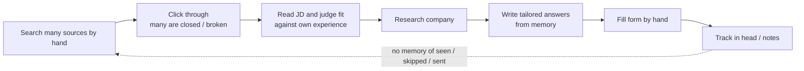
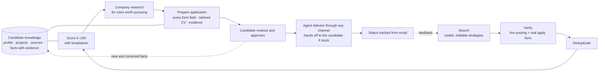
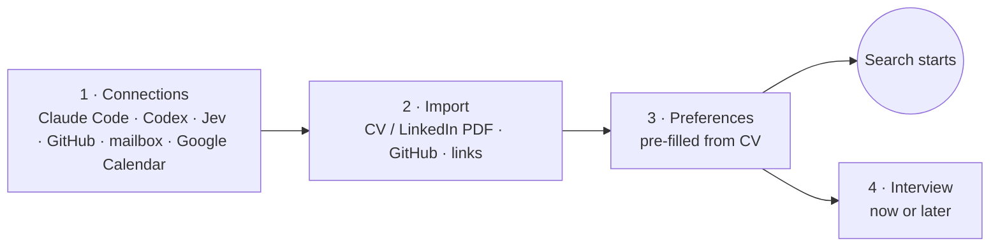
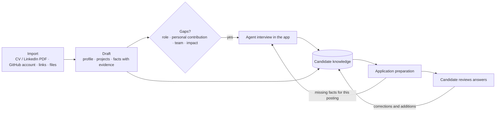
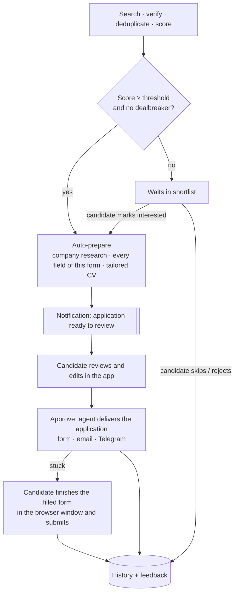
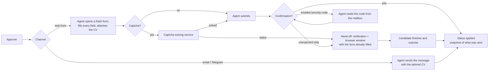
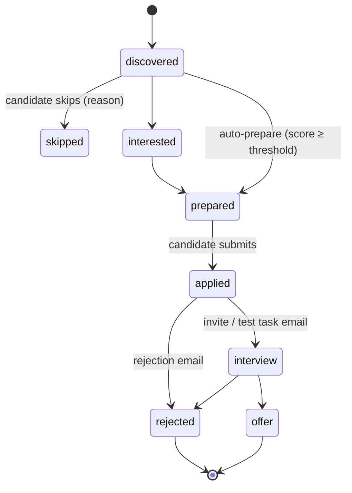

# Applyant: a personal, evidence-backed job-search harness

### Problem to Solve

A single experienced engineer looking for the right role (AI / Backend / Founding Engineer, Remote EU, Greece or Cyprus, at or above a salary floor) spends most of the effort on repetitive work rather than on picking roles and talking to companies. Per the task brief, that work covers the whole cycle: finding postings, checking them, judging fit, researching the company, writing tailored answers, filling in forms and tracking outcomes.

- **Finding postings is scattered and noisy.** Relevant roles are spread across ATS boards (Greenhouse, Lever, Ashby, Workable), company career pages, niche boards and search results. The same role often shows up several times from different sources.
- **Many "found" postings are dead ends.** Search results point to closed, archived or relocated postings, or the Apply button leads to a company homepage instead of a real form. The candidate only finds this out after clicking through.
- **Judging fit is manual and shallow.** Each posting has to be read against the candidate's real experience, location, remote policy, salary and language constraints. A single "match score" hides *why* a role fits or doesn't.
- **Tailored answers take the longest and are easy to get wrong.** Questions like "Tell us about an LLM system you built in production" require recalling the right project and the specifics of what the candidate personally built. Generic LLM tools either repeat the CV or invent experience the candidate can't back up.
- **Nothing remembers anything.** Which postings were already seen or rejected, where the candidate applied, which CV and answers were sent, and why a role was skipped all live in the candidate's head or in ad-hoc notes. Past good answers are rewritten from scratch.



### What does business success look like, and how can we measure it?

Success means the candidate spends their time choosing roles and reviewing near-final applications, not searching, clicking through dead links or writing answers from memory. Because this is a personal tool, success is measured by signals the system records itself from its own job and application history, not by product analytics.

#### The product is done when four metrics hold

| # | What we check | Metric | Target |
|---|---|---|---|
| 1 | **The shortlist has no dead postings** | Share of shortlisted postings whose Apply leads to a live, real application form | ≥ 95% |
| 2 | **The shortlist is relevant** | Share of shortlisted postings the candidate marks `interested` rather than `skip` / `reject` | ≥ 50% |
| 3 | **An application takes little of the candidate's time** | Human time from "I want to apply" to "ready to submit" (review plus edits) | ≤ 15 min per application (today roughly 45–90 min) |
| 4 | **The agent never invents experience** | Claims in sent answers that have no supporting evidence, or that the candidate had to correct as untrue | 0 |

#### The funnel is watched but not a target

- **Applications per week** and the **share that reach an interview** are tracked from week one.
- The first 2–3 weeks set a baseline, and later periods are compared against it.
- The funnel is deliberately not part of "done": it depends heavily on the job market, so it is a poor test of the system itself.

### Proposed Solution

Applyant is a native macOS app that runs the whole job-search cycle on the candidate's own Mac. It ships as one complete product, not as an MVP that gets filled in later: every stage in the task brief is part of the release. The system works autonomously up to a finished, evidence-backed application, and the candidate makes only two decisions: which roles to pursue and whether to submit.



- **Candidate knowledge with provenance** - a long-lived profile, projects and unlimited sources per project (GitHub, sites, docs, Drive, PDFs, local files, URLs). It's drafted from existing material, filled in by an agent interview, and grows with every application. Every fact traces back to evidence, and extracted facts must be confirmed before anything is sent. This is what keeps the agent from inventing experience.
- **Search across every source type, visible and editable** - ATS boards, company career pages, web search, specialised and startup boards, Telegram job channels, LinkedIn, Xing, RSS/APIs and direct crawling. The agent proposes and evolves strategies, and the candidate sees each one's results, can switch any source off and stays in control.
- **Verify and deduplicate before the candidate sees anything** - every posting is opened and checked for a live, real application form, then merged with its duplicates from other sources.
- **Explained 0–100 scoring** - each posting is scored against the knowledge base and preferences, always with its breakdown. Conditions are soft unless the candidate marks them as dealbreakers.
- **Company research for roles worth pursuing** - one reusable profile per company, with sources and red flags.
- **Evidence-backed preparation for the real form** - high-scoring postings are prepared automatically, the rest on request. Every field of the actual form gets a value, free-text answers show their evidence, and the CV is tailored to the role. Any web form (including LinkedIn Easy Apply and Xing), email and Telegram applications are supported.
- **Approve in the app, the agent delivers** - the candidate approves the prepared application, and the agent sends it on its own through whatever channel it needs: web form, email or Telegram. Captchas go to a solving service first. If the agent still gets stuck, the candidate is handed the already-filled form to finish.
- **Status tracked from the candidate's email** - replies move applications to rejected, interview or offer on their own, and feedback steers future searches as a signal, never a hard rule.
- **A native macOS app as the main interface, with a CLI alongside** - an Inbox of scored postings handled like mail, plus the menu bar, actionable notifications, a Share extension and Google Calendar. The CLI offers the same capabilities for terminal use and scripting.
- **Everything runs on the candidate's Mac, with no setup** - installing the app is the whole setup: no Docker, no separate server, no database administration. A background service starts at login and runs searches, workers, the browser and agent sessions. It keeps working from the menu bar when the main window is closed, and runs missed during sleep start as soon as the Mac wakes up. The app and the CLI only talk to this service and contain no business logic of their own.
- **Three tiers of models** - Claude Code / Codex (the candidate's own subscriptions, signed in on the Mac) for reasoning and writing, Jev for cheap bounded decisions, and Apple's on-device model for private tasks such as reading email.

### Alternative Solutions Considered

- **Staged MVP (knowledge-first, search-first or a thin end-to-end slice)** - rejected. The product ships complete, with no "build the basics now, finish later" phases.
- **CLI as the only interface** - rejected. The candidate can't review a filled form, solve a captcha or get notifications from a terminal, and the day-to-day experience should be a pleasant native app.
- **Web UI served by the service** - rejected. A web UI has to be deployed and hosted somewhere, while a native app is launched and just works. It also gives native notifications and a Mac look and feel.
- **Service on the always-on server (`ai-serv`) with the app as a remote client, or both modes** - rejected. 24/7 searching isn't worth maintaining a server, connecting over the network and streaming a headless browser into the app. Catching up after the Mac wakes is enough.
- **Building knowledge only by hand, or only by import** - rejected. Manual forms are slow and leave "what I personally built" empty. Import alone misses what isn't in the sources (role, team, impact). Import plus an ongoing agent interview covers both.
- **Using extracted facts straight away, or requiring approval of every fact up front** - rejected. The first lets a wrong fact slip into many applications unnoticed. The second means confirming hundreds of facts after import. Confirming on first use in review balances the two.
- **Fully hidden automatic search, or hand-written saved searches only** - rejected. A black box can't be trusted or tuned. Hand-written searches are extra work and never discover new directions.
- **LinkedIn and Xing via job-alert emails** - rejected. It would flood the candidate's mailbox. Listings are collected directly instead, with the account-risk question handed to technical research.
- **A paid search API (Brave, Serper, SerpAPI) for `site:` queries** - rejected. The agents' built-in web search covers it, and because web search is used mainly to discover new boards that are then watched directly, query volume stays low.
- **Text match categories (Strong / Possible / Weak / Blocked)** - rejected in favour of a 0–100 score with an adjustable threshold, which is more flexible.
- **System-decided hard blocks** - rejected. A salary slightly below target, or lower pay offset by excellent terms, should still be considered. Only the candidate's own dealbreakers are hard.
- **A Kanban pipeline board as the home screen** - rejected. Details are hidden behind a click on every card, and the New and Applied columns grow to dozens of cards. The funnel view lives in Overview instead.
- **Confirming every stage by hand** - rejected. Too many clicks and too much waiting between steps to hit ≤ 15 minutes per application.
- **A daily cap on automatic preparation** - rejected. A good match shouldn't wait because of an arbitrary number. Subscription limits are handled by queueing until the window resets.
- **Pre-filling live forms in the background** - rejected. ATS sessions expire, so pre-filled forms go stale. Preparing answers per field and filling on demand is just as fast and always fresh.
- **A review screen that mirrors the ATS form field by field** - rejected. The two or three answers that matter get lost among a dozen routine fields.
- **A single CV, or a few hand-maintained CV variants** - rejected. One CV can't emphasise the right experience for different role types, and hand-maintained variants add upkeep and still aren't specific to the posting.
- **Filling in a separate browser window by default** - rejected. Switching between the app and a browser breaks the flow. A separate window stays available only as a fallback.
- **The candidate presses submit in a browser embedded in the app** - rejected during technical design. Embedded browsers (WKWebView, CEF, Electron) block "Sign in with Google" on third-party sites and have documented captcha failures. Watching a form being filled also adds nothing once the answers are approved.
- **A browser extension in the candidate's own Chrome** - not needed. The agent delivers from its own browser profile.
- **Special handling for particular ATSs** - rejected. Every channel must work equally, so forms are read generically.- **Updating application status only by hand** - rejected. Statuses fall behind reality and the funnel metrics become unreliable.
- **One model for everything, or on-device models instead of Jev** - rejected. Using Claude/Codex for every small decision is slow and drains subscription limits. The on-device model is weaker at classification over large posting pages than Jev.

### Solution Details

The sections follow the candidate's journey: setting up, building knowledge, finding and judging postings, preparing and sending applications, then tracking outcomes.

#### First launch is a four-step setup, and searching starts before it's finished



1. **Connections.** The app checks that Claude Code and Codex are signed in on the Mac and explains how to fix it if not. It then asks for the Jev key, GitHub, the mailbox and Google Calendar. Keys are stored in the macOS Keychain. Any step can be skipped, and the app says plainly what won't work without it.
2. **Import.** The candidate drops in a CV or LinkedIn PDF, names their GitHub account and adds links. The profile and project draft is built in the background while setup continues.
3. **Preferences.** Roles, locations, remote policy, target salary and dealbreakers, pre-filled from the CV for the candidate to adjust. Searching starts as soon as this step is done.
4. **Interview.** The agent asks its first gap-filling questions about projects. The candidate can answer now or choose "Later".

#### Candidate knowledge is drafted from sources, filled in by interview, and keeps growing

The knowledge base about the candidate is never "done". It starts as an automatic draft and gets richer with every conversation and every application.



- **Onboarding starts from what already exists.** The candidate provides a CV or LinkedIn PDF, a GitHub account and any links or files. The system drafts the profile, the list of projects and facts, each with evidence pointing back to its source. Any number of sources can be attached to a project: repos, sites, docs, Drive files, PDFs, local folders, URLs. The candidate reviews and edits the draft rather than typing everything from scratch.
- **An agent interviews the candidate to fill what sources can't show.** For each project the agent spots the gaps (personal role, what the candidate personally built, team, business impact) and asks about them in a chat inside the app. For example: "In Solovei the repo shows a call-analysis pipeline. Which part did you build yourself? How big was the team? What was the business result?" Answers become facts with `manual` evidence. The interview can be done all at once or in pieces.
- **The interview comes back when a posting needs facts that don't exist yet.** If preparing an application reveals a missing fact, for example "Have you led a team?" or "Experience with Kubernetes in production?", the agent asks the candidate. The answer is used for this application **and saved to the knowledge base**, so the question is never asked twice.
- **Review edits enrich knowledge too.** When the candidate corrects or adds something while reviewing a prepared answer or CV, the new information is saved as a fact, not lost in a single application.
- **Sources stay in sync.** Sources can be re-synced (all, per project or per source type), so new work in a repo becomes new facts.

#### Extracted facts are usable in drafts but must be confirmed before anything is sent

Every fact carries a status, so speed never costs trust.

- **Facts from sources start as `unconfirmed`; facts from the candidate are `confirmed`.** Anything the system extracts from a repo, site or document starts as `unconfirmed`. Anything the candidate states in an interview or an edit is `confirmed`.
- **Drafts may use unconfirmed facts, but they are highlighted.** When reviewing a prepared application, every sentence that relies on an unconfirmed fact is visibly marked. One click confirms the fact for good. Editing it saves the corrected version as a confirmed fact.
- **Nothing unconfirmed reaches a submitted application.** The candidate only confirms the facts actually needed, at the moment they're needed, not hundreds of facts up front.
- **Code facts are attributed by authorship.** The candidate's GitHub identities (logins and commit emails) are part of the profile. Claims like "built X" come only from the candidate's own commits and PRs. Other people's work in the same repo is described as team context, never as the candidate's personal contribution.

#### Search strategies are proposed by the agent, visible, and editable

The candidate doesn't write search queries, but they can always see what is being searched and how well it works.

| Strategy | Sources | Last run | Found | Verified | Interested | State |
|---|---|---|---|---|---|---|
| AI / ML · Remote EU | Ashby, Greenhouse, Lever, web search | 14:20 | 38 | 29 | 41% | Active |
| Founding / CTO | startup boards, YC, HN "Who is hiring" | 14:20 | 12 | 9 | 56% | Active |
| Greece / Cyprus | Workable, company career pages, local boards | 14:20 | 17 | 11 | 18% | Runs less often |
| `site:jobs.ashbyhq.com "LLM Engineer" Europe` | web search | 08:20 | 6 | 5 | 60% | New (agent-generated) |
| AI / Backend · Telegram | 14 job channels | 14:20 | 21 | 13 | 31% | Active |
| AI Engineer · LinkedIn + Xing | LinkedIn Jobs, Xing Jobs | 14:20 | 44 | 30 | 38% | Active |

*Illustrative Search section.*

- **Strategies come from the profile.** Based on roles, locations, stack and preferences, the agent proposes parallel strategies that span every source type: ATS boards, company career pages, web search, specialised and startup boards, Telegram job channels, LinkedIn and Xing, RSS/APIs and direct crawling.
- **Telegram job channels are a first-class source.** Public channels are read without signing in. The candidate can optionally connect their own Telegram account to include private channels and chats. The agent turns posts into postings (role, company, salary, location, contact), suggests channels to follow and adds new ones over time.
- **LinkedIn and Xing are searched directly.** Their job listings are collected like any other source, not through email alerts, so the mailbox isn't flooded. When a LinkedIn or Xing posting also exists on the company's own site or ATS, the system links them and applies through the original form.
- **Web search discovers companies, and their boards are then watched directly.** Web searches (including `site:` queries such as `site:jobs.ashbyhq.com "AI Engineer" Europe`) run through the agents' built-in web search in Claude Code / Codex, with no separate search API. Web search is mainly used to discover *new companies and boards*. Once found, a company's job board is added to a watch list and checked directly on every run. This keeps web searches few and the coverage growing.
- **The agent keeps inventing new queries and sources.** New strategies show up marked "agent-generated", so the candidate sees what was added.
- **Each strategy shows its own results.** Found, verified and marked `interested`, so it's obvious which strategies bring good roles.
- **Weak strategies are run less often, never silently removed.** Strategies with a low interested rate run less often and say so.
- **The candidate stays in control.** They can pause, edit or delete any strategy, add their own, and set the schedule (for example every 6 hours). The same actions are available from the CLI.
- **Every source can be switched off.** Search also lists every source (Greenhouse, Lever, Ashby, Workable, Telegram, LinkedIn, Xing, each job board, web search, watched company boards) with an on/off toggle and its own found / verified / interested numbers. Individual channels, boards and companies can be switched off as well. A disabled source is never queried.
- **Postings found by the candidate enter the same flow.** A URL shared from the browser or added with `jobs add <url>` is verified, scored and prepared like any other.

#### Only live postings with a real application path reach the candidate

A posting is never shown just because a search returned it.

- **Every posting is opened and checked.** Does the URL work? Is the posting still open and not archived? Does Apply lead to a real application form or a real email address rather than a company homepage?
- **Each posting appears once, however many places it came from.** The same role found via web search, an ATS board, a job board and the company site becomes one posting that remembers all its sources.
- **Postings that fail verification never appear in the Inbox.** They are kept in history (so they aren't re-checked from scratch), and a posting that closes later is marked closed wherever it appears.
- **Verification is shown on the posting.** For example "✓ apply form verified · 2 h ago".

#### Every posting gets an explained 0–100 score

Matching produces a single number the candidate can sort and set thresholds on, and it always shows how that number was reached.

- **The score is built from visible components, not a gut-feel LLM number.** It combines must-have requirements backed by evidence, nice-to-haves, role and seniority fit, location and remote policy, salary, language and employment type. The same posting gets the same score from run to run.
- **Every posting shows the breakdown next to the number.** Strong, partial and missing requirements, plus deviations such as "Salary €2,500 - 17% below target", so the candidate always sees *why*.
- **All conditions are soft by default.** Deviations from preferences lower the score in proportion to how far off they are, so a slightly lower salary costs a little and very attractive terms elsewhere can make up for it. The system never rules a posting out on its own judgement.
- **Only the candidate creates dealbreakers.** Any preference can be marked as a dealbreaker in the profile, for example "never outstaff" or "hide below €2,000". Postings that hit one are never auto-prepared.
- **Salary has a target and an optional floor.** The target (e.g., €3,000) feeds the score. The floor is set only if the candidate really wants a hard cutoff.
- **Feedback nudges and never forbids.** Skipping with a reason such as "salary too low" shifts the scores of similar postings. It never becomes a hard rule by itself.

#### The app opens on an Inbox of scored postings, handled like mail

The main window follows the familiar Mail layout: sections in the sidebar, postings sorted by score in the middle, and the selected posting's full picture on the right. The daily routine is going through new postings and deciding `interested` / `skip`, and with the score breakdown on screen each decision takes seconds.

```task-artifact
/home/romirom/.humanlayer/workspaces/local-job-search-agent-harness-system-2vuidu/applyant/.humanlayer/tasks/local-job-search-agent-harness-system-2vuidu/mockup-home-inbox.html
```

- **The sidebar follows the life of a posting.** **Overview** shows the funnel at a glance. **Jobs** has Inbox, Ready to review, Preparing, Interested and Skipped. **Applications** has Applied, Interviews and Offers. **Me** has Profile, Projects and the agent Interview (with a badge for open questions). **System** has Search, Agent runs, Companies and Settings.
- **Each list row shows what needs attention.** Every row shows the score, title, company, location and salary, plus chips for state ("Ready to review", "Preparing…"), the most important deviation ("Salary 7% below target") and the source ATS.
- **The detail pane explains the score and offers the next step.** It shows the score breakdown per component, requirements marked ✓ / ~ / ✗ with the evidence behind each, potential issues, and actions: Review application, Company research, Skip… (with a reason), and Open posting.

#### Company research is done once per company, for roles worth pursuing

- **It runs when a role is worth it.** Research runs automatically as part of preparing an application (score at or above the threshold, or marked `interested`), and on demand with **Company research** on any posting. It is not run for every posting found.
- **It covers what matters for a decision.** Product and business model, funding and size, founders and team, tech stack, recent news, layoffs, remote culture, employee reviews and salary data where available. Every item links to its source.
- **Red flags get their own block.** Recent layoffs, poor reviews, outstaffing presented as a product company, or pay out of line with the market. Like everything else they are soft signals that feed the score.
- **One company, one profile.** Research lives in **Companies** and is shared by all of that company's postings. It is refreshed when older than about 30 days. It also supplies material for "Why us?" answers and interview preparation.

#### The candidate only steps in to choose and to submit

The system works on its own right up to a finished draft. The candidate makes two decisions: which roles to pursue and whether to submit.



- **Preparation targets the real form, not a generic question list.** When the system prepares an application, it reads the posting's actual form: every field, option list, required flag and upload slot. It then prepares a value for each one, from simple fields (name, email, salary, work authorization, CV file, links) to long free-text answers with evidence.
- **Previous answers are reused thoughtfully, never copied blindly.** When a similar question was answered before, the earlier answer is adapted or a more relevant project is chosen, and the answer says what it was adapted from.
- **Nothing is filled in advance.** Prepared answers are stored with the application, not typed into a live form, so they never go stale with an ATS session. When the candidate clicks **Approve**, a fresh form is opened, filled from the prepared answers and submitted.
- **High scorers are prepared automatically, the rest on request.** Postings that score at or above the auto-prepare threshold (default 80, adjustable) and hit no dealbreaker go straight to preparation. Everything else waits in the shortlist until the candidate marks it `interested`, which starts the same preparation.
- **No artificial cap on automatic preparation, and subscription limits are handled by queueing.** Every qualifying posting gets prepared. If Claude or Codex hits a subscription limit, the work waits for the window to reset and then continues. The app shows this plainly, for example "Waiting for Claude limit - resumes at 15:45".
- **Nothing is sent without the candidate's approval.** The agent delivers an application only after the candidate has approved that specific application.

#### Every application channel works the same way: any web form, email and Telegram

No channel is primary and none gets special treatment. An applicant tracking system (Greenhouse, Lever, Ashby, Workday…), a company's own form, a job board, LinkedIn Easy Apply, an email address and a Telegram contact all go through the same read → prepare → review → approve → deliver flow.

| Application channel | What the system does |
|---|---|
| **Any web form** (ATS, company sites, job boards, LinkedIn Easy Apply, Xing, multi-step wizards) | Reads the form itself, prepares every field, and after approval fills and submits it |
| **Sites that require an account** (e.g., Workday, LinkedIn, Djinni) | The candidate signs in once in Applyant's browser window, and the session is reused. New ATS accounts are created with the candidate's help, and logins are stored in the macOS Keychain |
| **Email applications** ("send your CV to jobs@…") | Prepares an email with the tailored CV and a cover note, and after approval sends it from the candidate's mailbox |
| **Telegram contact** ("write to @recruiter") | Prepares a message and the tailored CV, and after approval sends it from the candidate's Telegram account |

When the same role exists in several places (for example LinkedIn Easy Apply and the company's own form), the company's own form is the default, and the candidate can switch per application.

#### Reviewing an application puts the answers first

The review screen is built around the few answers that actually need thought. Everything routine is summarised, and every claim can be traced back to its evidence.

```task-artifact
/home/romirom/.humanlayer/workspaces/local-job-search-agent-harness-system-2vuidu/applyant/.humanlayer/tasks/local-job-search-agent-harness-system-2vuidu/mockup-review-application.html
```

- **Standard fields collapse to one line.** Name, contacts, links, location, work authorization, notice period and salary show as "11 standard fields ready", with **Show all** to expand. A field with a problem (missing value, ambiguous option) is pulled out and shown on its own.
- **The tailored CV has its own card.** It shows how the CV was adapted for this role, with Preview, Edit and "Use base CV instead".
- **Long answers get the space.** Each free-text question shows its prepared answer. Sentences that rely on unconfirmed facts are highlighted in the text.
- **Every answer says what it's based on.** A footer lists the sources, for example "Solovei project · repo · 2 manual facts" or "adapted from the answer sent to Orbit (Sep 12)". Quick actions sit next to it: Edit, Shorter, Use another project…
- **Evidence sits on the right, next to the selected answer.** Each supporting fact shows its source, its status (`confirmed` / `unconfirmed`) and **Confirm** / **Edit** actions, with a short company-research summary below.
- **Approve unlocks only when nothing unconfirmed is left.** The title bar counts the remaining unconfirmed facts, and **Regenerate…** redrafts answers on request.

#### Every application gets a CV tailored to the role

Each application's CV is assembled from the knowledge base for that specific posting, so an AI Engineer role and a Founding Engineer role each see the most relevant version of the same true story.

- **Emphasis is tailored, never the facts.** The system picks which projects come first, which achievements and technologies are brought forward, and how the summary is phrased. Only confirmed facts are used.
- **Layout comes from the candidate's own template.** The PDF uses the candidate's template (for example "Clean"), so every CV looks consistent and professional.
- **The CV is reviewed alongside the answers.** It appears as a card on the review screen with Preview and Edit. Edits to the content are saved back as facts, like any other review edit.
- **A base CV is always one click away.** "Use base CV instead" swaps in the candidate's standard CV for any application.
- **The exact CV sent is kept.** Every submitted PDF is stored in the application's history.

#### Approved applications are delivered by the agent, and a browser appears only when it gets stuck

After **Approve**, the candidate doesn't watch anything being filled. The agent delivers the application and reports back.



- **Progress is visible without a browser.** The application shows what's happening, for example "Filling 14/16 fields · resume uploaded · solving captcha".
- **Captchas are solved automatically first.** A captcha-solving service handles the common types. Emailed security codes are read from the connected mailbox.
- **Hand-off is the fallback, not the norm.** If a captcha can't be solved or the form asks something unexpected, the candidate gets a notification. One click shows the browser window with the form already filled, where they finish and press submit.
- **Applyant's browser is its own.** It uses a separate profile that doesn't appear in the candidate's everyday Chrome. Sites that need a login are signed into once, in a normal window.
- **Submission is confirmed and recorded automatically.** After submit the system checks the confirmation page, marks the application `applied`, and stores exactly what was sent: every field value, the CV version, the answers, the salary stated and the source.

#### Application status updates itself from the candidate's email

Once an application is sent, the candidate doesn't have to maintain its status. The system reads replies from the mailbox and keeps every application current.



- **The candidate connects their mailbox once.** Gmail or any IMAP mailbox.
- **Company replies are recognised and linked to the right application.** ATS acknowledgements, rejections, interview invitations, test assignments and offers are matched to the application they belong to, and the status moves on its own. Email is read by the on-device model, so its contents never leave the Mac.
- **Important changes arrive as notifications.** For example "Helix invites you to a tech call - open". The email is kept in the application's history, along with company contacts and the candidate's notes.
- **When unsure, the system asks.** If an email can't be matched confidently, the candidate is asked which application it belongs to, or whether it belongs to any.
- **Every status can be corrected by hand**, in the app or from the CLI.

#### Three tiers of models, each doing what it's best at

Each kind of work goes to the cheapest model that does it well. Private data stays on the Mac.

| Tier | Used for | Why |
|---|---|---|
| **Claude Code / Codex** (candidate's subscriptions) | Scoring, company research, writing answers and CVs, analysing sources, planning searches and web search, reasoning about unfamiliar forms | Needs deep reasoning and writing |
| **Jev** (hosted decision model) | Cheap, fast decisions with a fixed set of answers: "Is this posting still active?", "Which element is Apply?", "Which option means Remote?", "Is this field the salary?", "Should this go to verification?" | Thousands of small decisions a day at very low cost, without draining subscription limits |
| **Apple on-device model** | Private and small tasks: classifying the candidate's email (rejection / interview / offer / unrelated) and writing short notification text | Mail never leaves the Mac; works offline and for free |

- **Every role is visible and reassignable in Settings.** The candidate sees which model handles which role and can change it, for example `matcher: claude`, `researcher: codex`, `application_writer: claude`.
- **The product isn't tied to one provider.** Any role can move between Claude and Codex without other changes.

#### The app lives in macOS, not just on it

Three macOS integrations, plus Google Calendar, make Applyant useful without keeping the main window open.

- **Menu bar.** Shows live status ("Search run · 12 workers", "Waiting for Claude limit · resumes 15:45"), counters ("5 ready to review") and quick actions without opening the main window.
- **Actionable notifications.** For example "Acme AI · Senior AI Engineer · 91", with **Review** and **Skip** buttons right in the notification. Status changes from email ("Helix invites you to a tech call") arrive the same way.
- **Share extension.** A posting the candidate found on their own can be sent via Share → Applyant from Safari or Chrome. It then goes through the same verify → score → prepare flow as everything else.
- **Google Calendar.** An interview invitation detected in email becomes an event in the candidate's Google Calendar, linked to the application and its company research. macOS Calendar is not used.

#### The CLI can do everything the app can

The CLI talks to the same background service and is meant for terminal use and scripting. The brief's command shape is kept:

````text
jobs search | list | show 182 | add <url>
jobs interested 182 · jobs skip 173 --reason "salary too low"
applications preview 182 · applications submit 182 · applications status 182 interview
candidate show · candidate project list | add | show solovei
candidate source add solovei github https://github.com/...
candidate sync [solovei | github]
runs show 391 · search strategies [list | pause | edit]
````

- **Submitting from the CLI is an explicit approval.** `applications submit 182` approves the application and hands it to the agent, exactly like **Approve** in the app.

### Out of Scope

- **Spotlight indexing and Shortcuts / Siri actions** - little value for this workflow compared with the menu bar, notifications, the Share extension and Google Calendar.
- **A web UI and a server-hosted mode** - the product runs on the Mac as a native app (see Alternative Solutions Considered).
- **Sending without approval** - the system never delivers an application the candidate hasn't approved.
- **Multiple candidates or accounts** - Applyant is a personal tool for one candidate on their own Mac.

### Deferred to TDD

- How the database (PostgreSQL + vector/full-text search in the brief) is packaged so it runs on the Mac without Docker or manual setup.
- How the background service is installed and kept alive (login item, menu-bar helper) and how the app and CLI talk to it.
- Which browser the agent uses to fill and submit, how captchas are solved, and how a hand-off to the candidate keeps the filled form.
- How the score components are computed and weighted so scores are stable from run to run.
- How email is accessed (Gmail API vs IMAP) and how Google Drive sources are authorised.
- How LinkedIn and Xing listings are collected and their apply forms filled. Resolved in the TDD: full automation under the candidate's own session, as the candidate chose knowing the account risk, with pacing and volume guardrails.
- How Telegram channels are read: public web previews vs the candidate's own account for private channels.
