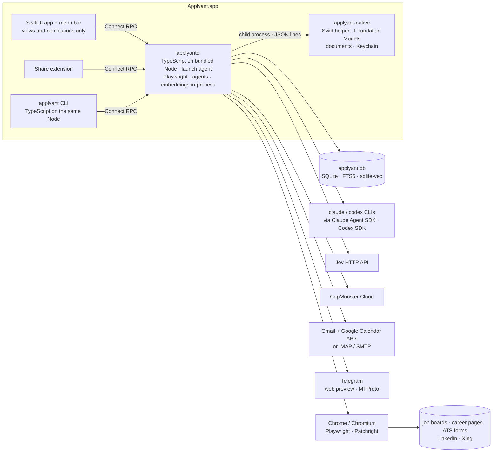
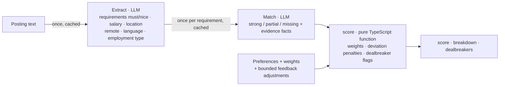
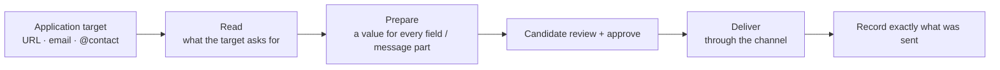
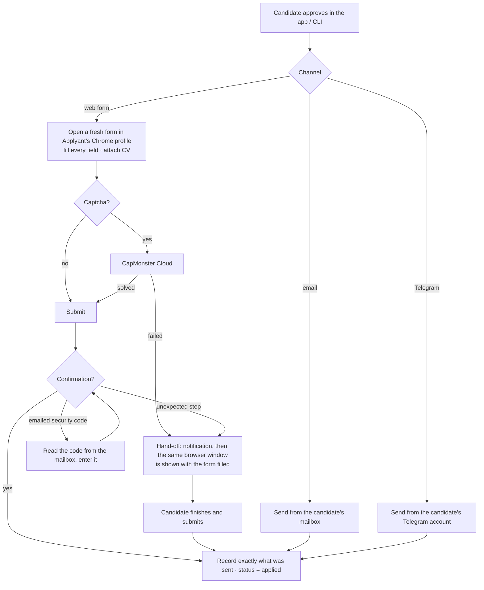
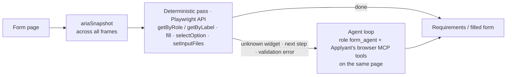
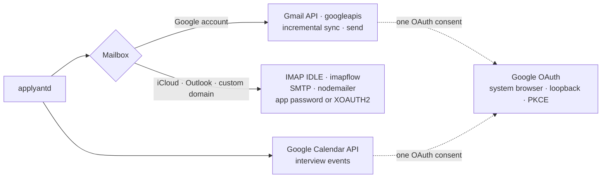
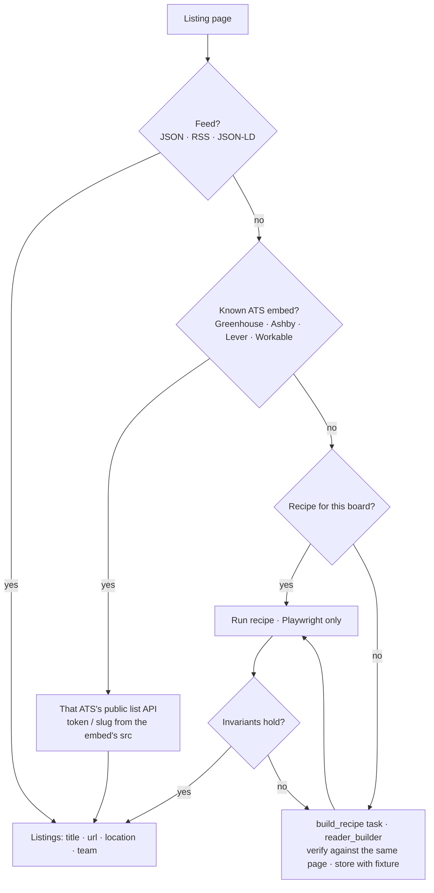
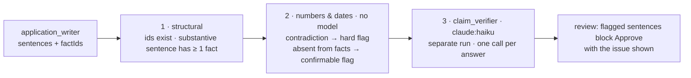

# Applyant: technical design

### System Design

#### Everything is new: the repo is empty and the product targets the candidate's Mac

Today `applyant` has one commit with a one-line README (per the research doc, §1). The research was run on `ai-serv` (headless Ubuntu), but the PRD targets a native macOS app on the candidate's own Mac, with no server-hosted mode. So every component below is new. The target is macOS 26 on Apple silicon, and development and testing happen on the Mac.

#### A TypeScript background service owns all logic; the SwiftUI app and the CLI are thin clients

The PRD fixes the process layout: a background service starts at login and does all the work, while the SwiftUI app and the CLI only talk to it. The service, `applyantd`, is written in **TypeScript** and runs on a Node runtime bundled inside `Applyant.app`. Swift is used only for the app itself and for a small helper that reaches Apple-only frameworks.



TypeScript was chosen because the hardest part of the product, reading and submitting arbitrary forms, lives on Playwright, and Playwright is native to Node:

- **The browser runs in the daemon's own process.** Playwright and Patchright (a Playwright fork that avoids the CDP `Runtime.enable` leak) both run inside `applyantd`. Accessibility snapshots, cross-origin iframes (`frameLocator` across all frames) and uploads need no IPC and no serialisation. Playwright for Python is a port that drives a bundled Node driver over stdio, so it would hide a second runtime. A Go daemon would need a Node sidecar for the same reason (research §10).
- **The agent SDKs are primary in TypeScript.** `@anthropic-ai/claude-agent-sdk` and `@openai/codex-sdk` are the first-party wrappers around the `claude` and `codex` CLIs (research §2–3). Jev is a single HTTP `POST /v1/systemone` (research §4).
- **One RPC ecosystem end to end.** `connect-es` on the server and `connect-swift` in the app are generated from the same `.proto`.
- **Embeddings run in-process.** `@huggingface/transformers` loads `onnx-community/embeddinggemma-300m-ONNX` through `onnxruntime-node`, on the CPU.

#### The app bundles the official Node runtime and `node_modules`; nothing is compiled into a single executable

Native modules (`better-sqlite3`, `sqlite-vec`, `onnxruntime-node`) break under Node SEA and `bun build --compile`, so the daemon ships as plain files inside the signed bundle:

```text
Applyant.app/Contents/
├── MacOS/Applyant                              # SwiftUI app
├── Resources/
│   ├── node/bin/node                           # official Node, darwin-arm64 (~100 MB)
│   ├── daemon/                                 # compiled JS + production node_modules
│   │                                           #   every *.node binary is codesigned for notarisation
│   └── bin/applyant                            # CLI launcher: exec node daemon/cli.js "$@"
├── Helpers/applyant-native                     # Swift helper
└── Library/LaunchAgents/com.applyant.daemon.plist

~/Library/Application Support/Applyant/
├── applyant.db · files/ · repos/
├── browser/     # Applyant's own Chrome profile (logins, submission)
├── browsers/    # PLAYWRIGHT_BROWSERS_PATH: Chromium headless shell for background reading, fetched on first launch
└── models/      # embeddinggemma-300m-ONNX, fetched on first launch
```

- **It starts at login and stays alive through macOS itself.** The app registers `com.applyant.daemon` with `SMAppService` (`KeepAlive`, so launchd restarts it after a crash) and registers itself as a login item for the menu bar. The first app launch registers both, and no separate installer exists.
- **The CLI is the same code on the same Node.** `applyant` is a launcher script symlinked onto `PATH`, so the CLI never drifts from the daemon's generated client.

#### The app and the CLI speak one Connect RPC API on localhost, defined in a single `.proto`

`applyant.proto` is the only contract between the service and its clients. It generates the server (`connect-es` on Node), the TypeScript client used by the CLI and the Swift client used by the app and the Share extension (`connect-swift`), so the clients can't drift apart. The macOS app really is "just another client", as the brief asked.

```protobuf
service Applyant {
  rpc ListPostings(ListPostingsRequest) returns (ListPostingsResponse);
  rpc GetApplication(GetApplicationRequest) returns (Application);
  rpc ApproveApplication(ApproveApplicationRequest) returns (ApproveApplicationResponse);
  // ...one RPC per app / CLI action
  rpc WatchEvents(WatchEventsRequest) returns (stream Event);  // task progress, new postings, hand-offs, limit pauses
}
```

- **The service listens on `127.0.0.1` only, behind a bearer token.** The port and token are written to a `0600` file in the app's App Group container, which the app, the sandboxed Share extension and the CLI read on start. Browser pages and other users' processes can't call the API.
- **Live updates are one server stream.** `WatchEvents` pushes task progress, new postings, hand-off requests and limit pauses. The app uses it for the menu bar, notifications and live lists, and `applyant runs show --follow` uses the same stream.

#### All state lives in one SQLite file that only the service opens

The brief assumed PostgreSQL + pgvector (research §8). The PRD's "installing the app is the whole setup" rules out Docker, and an embedded Postgres would add a supervised child process, `initdb` and major-version upgrades to a personal desktop app. So all state lives in one SQLite database (`applyant.db` above, WAL mode).

- **Only `applyantd` opens the database.** The app and the CLI read and write through the service, so there's exactly one writer and business rules can't be bypassed.
- **SQLite covers everything the brief wanted from Postgres.** FTS5 handles keyword search and `sqlite-vec` handles embeddings, and hybrid retrieval is the same reciprocal-rank-fusion query shape as research §8. At one candidate's scale (thousands of postings, tens of thousands of facts and chunks), brute-force vector search takes well under 100 ms. The driver is `better-sqlite3` with the `sqlite-vec` npm extension. This is a necessity, not taste: Node's built-in `node:sqlite` is built with `SQLITE_OMIT_LOAD_EXTENSION` on macOS, so `sqlite-vec` can't be loaded into it.
- **Heavy reads never block the event loop.** `better-sqlite3` is synchronous. Short writes stay on the main thread, while FTS, vector and hybrid-retrieval queries run on read-only connections in a `worker_threads` pool, which WAL allows alongside the writer. The main thread also hosts Playwright and the `WatchEvents` stream, so it stays free.
- **Duplicate postings are found without an LLM.** Exact keys come first (canonical URL, ATS job id, normalised company + title). Then MinHash over description shingles catches reposts, with embedding similarity as a tie-breaker.
- **The task queue is a table in the same file** (see the pipeline below).

#### The pipeline is a state machine per posting and application, driven by one task queue

Each posting and each application carries its own `stage`. A worker leases a task, runs its handler outside any transaction, then commits the result, the entity's next stage and the next task together. Postings move independently, so a slow page never holds back the rest. A restart simply resumes from the queued tasks.

```text
postings.stage:     found → verified → deduped → scored ──(score ≥ threshold, or marked interested)──► preparing
                             └─ failed_verification (kept in history)       └─ skipped (reason)
applications.stage: preparing → ready_for_review → approved → delivering → applied | needs_candidate
                                                                     applied ─(mail)→ interview | rejected | offer

tasks(id, kind, entity_id, run_id, provider, status, attempts, run_after, lease_owner, lease_expires_at)

  tx1 (milliseconds):  UPDATE tasks SET status='running', lease_owner=:w, lease_expires_at=now+lease
                       WHERE id = (oldest runnable, provider not paused)
  handler:             runs with NO transaction open (LLM calls, browser work: seconds to minutes),
                       renewing the lease periodically
  tx2 (milliseconds):  write results + move entity stage + enqueue next task
                       ... WHERE tasks.id=:id AND lease_owner=:w   -- 0 rows ⇒ lease was lost, discard results
  failure:             retry with backoff; a provider limit sets run_after = the reset time
  crash:               tasks with an expired lease are requeued
```

- **No transaction ever spans a handler.** SQLite has one writer, so transactions stay millisecond-short and a two-minute agent call never blocks other writes.
- **Search runs are just scheduled tasks.** The scheduler enqueues a `search` task per active strategy on its schedule. After the Mac wakes, each missed schedule runs once rather than once per missed slot. Node can't observe sleep and wake itself, so `applyant-native` forwards `NSWorkspace` `didWake` notifications over its JSON-lines channel.
- **A "run" is a label, not a structure.** Every task spawned from a search carries its `run_id`, which is what `runs show 391` and the Agent runs screen group by.
- **Every entry point joins the same machine.** Postings from search, from the Share extension, from `jobs add <url>` or from a Telegram post all start at `found`.

#### Every model call goes through a named role, and each role is mapped to a provider and model

No code calls "Claude" or "Jev" directly. It asks for a role, and a single routing table decides which provider and model answer it. So Jev can be switched off and expensive models are kept off trivial work. The PRD's Settings screen ("which model handles which role") edits this table.

```yaml
# defaults; every line is editable in Settings and the CLI
roles:
  field_classify:     jev            # "is this field the salary?", batched per form
  option_match:       jev            # "which option means Remote?"
  posting_liveness:   jev
  form_agent:         claude:sonnet  # agent loop for unknown widgets / wizard steps
  extractor:          claude:sonnet  # posting → structured requirements, salary, location (cached)
  search_planner:     codex
  reader_builder:     claude:sonnet  # writes a listing recipe once per board
  matcher:            claude:sonnet
  researcher:         codex
  application_writer: claude:opus
  claim_verifier:     claude:haiku   # entailment per answer; never Jev (counting / literal-reading failures)
  email_classify:     apple          # on-device, mail never leaves the Mac (see Apple-only capabilities)
fallbacks:
  jev: claude:haiku                  # used when Jev is off, unavailable, or not confident
```

- **Jev is optional.** Turning it off reroutes its roles to the fallback model (by default `claude:haiku`) with no other changes.
- **Low-confidence decisions escalate.** A Jev answer below a per-role confidence threshold is re-asked of the fallback model.
- **Small decisions are batched.** One call classifies all fields of a form rather than one call per field, so the LLM fallback stays fast.

#### Each agent task is a fresh, short-lived CLI process, and conversations live in SQLite

Every agent task spawns a new CLI process: scoring, company research, writing answers and CVs, the form agent loop, and each interview turn. It goes through a single `query()` call of the Claude Agent SDK, or a `run()` of the Codex SDK, and each spawns its CLI. The service assembles the task's context from SQLite, passes a strict output schema and exposes only the tools the role needs. Tasks share nothing, so a failure is retried by simply running the task again, and parallelism is just more processes.

```text
applyantd
  AgentRunner.run(task)
    role → provider/model                              (routing table above)
    context ← SQLite (facts, posting, form, company, interview transcript)
    claude:  query({ prompt, options: { model, outputFormat: {type:'json_schema', schema},
                                        mcpServers: { applyant: <local HTTP MCP + task token> },
                                        allowedTools: <role tools> } })
    codex:   codex.startThread({ model, ... }).run(prompt, { outputSchema })
    stream events → task progress (WatchEvents)
    structured output → validate against schema → write to SQLite (tx2)
```

- **Every agent run is kept.** Its event stream is written to `files/runs/<task>.ndjson`, and a summary row goes into `agent_runs` (role, provider, model, duration, tokens, outcome). This powers the Agent runs screen and `runs show`.
- **The interview transcript is Applyant's, not the CLI's.** Each interview turn is stored in SQLite, and the next turn is a fresh process seeded with the transcript plus the relevant facts. CLI session files (`~/.claude/projects/…`, `~/.codex/…`) depend on the working directory and can be lost on CLI updates, so they're never relied on.
- **Subscription limits pause a provider, not the system.** Limit messages such as "You've hit your session limit · resets 15:45" are recognised (research §2–3). The provider's queue is paused until the reset time, and tasks routed to other providers keep running. This drives the PRD's "Waiting for Claude limit - resumes at 15:45".
- **Tools reach the agent over one long-lived MCP endpoint.** `applyantd` serves the browser tools (below) and read-only knowledge lookups as a streamable-HTTP MCP server on `127.0.0.1`, built with `@modelcontextprotocol/sdk`. Each task gets a per-task token that scopes which tools and which browser context it may use. A stdio MCP server would fork an extra process for every CLI run.

#### Sources are read by generic readers; agents only add judgement on top

Search sources and knowledge sources follow one rule: generic readers fetch raw material, and agent roles interpret it. Nothing is written per site.

| Source | How it's read |
|---|---|
| **Job boards, company career pages, watched boards** | A generic reader that uses a feed when there is one (JSON, RSS, schema.org `JobPosting` JSON-LD). Otherwise it uses the public list API of an embedded Greenhouse / Ashby / Lever / Workable board, or a listing recipe an LLM wrote once for that board (see Program Design). Boards found by web search are added to a watch list and polled directly |
| **Web search** | Runs inside Claude / Codex tasks using their built-in web search (role `search_planner`), with no separate search API |
| **Search strategies** | Rows in SQLite (sources, queries, schedule, state), proposed by `search_planner` and editable by the candidate |
| **LinkedIn, Xing** | Their search pages, in Applyant's browser profile under the candidate's session, with the platform guardrails described below |
| **Telegram** | Public channels through the `t.me/s/<channel>` web preview without login. The candidate's own account over MTProto (GramJS) for private channels and for sending, with the session kept in the Keychain |
| **GitHub** | A partial clone (`--filter=blob:none`) plus the REST / GraphQL API for PRs and issues. "Built X" claims come only from commits by the candidate's logins and emails |
| **Google Drive** | The same Google consent as Gmail and Calendar, with `drive.readonly` added |
| **PDF / DOCX / local files / URLs** | Documents become text through `applyant-native` (PDFKit, AppKit), and web pages through readability extraction |

#### Candidate knowledge is facts with provenance and a confirmation status

Everything the agents say about the candidate comes from `facts`, and every fact points at its evidence. This is the data contract that scoring, preparation and review all rely on.

```sql
CREATE TABLE facts (
  id          INTEGER PRIMARY KEY,
  project_id  INTEGER REFERENCES projects(id),      -- NULL for profile-level facts
  text        TEXT NOT NULL,                        -- "Built the call-analysis pipeline"
  kind        TEXT NOT NULL,                        -- personal_contribution | team_context | skill | impact | ...
  status      TEXT NOT NULL,                        -- unconfirmed | confirmed | rejected
  origin      TEXT NOT NULL                         -- extracted | interview | review_edit
);
CREATE TABLE evidence (
  fact_id     INTEGER REFERENCES facts(id),
  source_id   INTEGER REFERENCES sources(id),       -- repo · site · doc · Drive file · PDF · URL · manual
  locator     TEXT                                  -- file path, commit SHA, PR number, URL fragment, page
);
-- facts are indexed in FTS5 and sqlite-vec for retrieval
```

- **Extracted facts start `unconfirmed`, and the candidate's own words are `confirmed`.** Drafts may use unconfirmed facts, but an application can't be approved while any fact it relies on is unconfirmed.
- **Answers are stored sentence by sentence, each with its facts.** The `application_writer` output schema returns an answer as `sentences[{text, fact_ids[]}]`. Review highlights exactly the sentences that rely on an unconfirmed fact, and selecting a sentence shows its evidence, as the PRD promises.

```json
{ "question_id": "q7",
  "sentences": [
    { "text": "At Solovei I designed the asynchronous call-analysis pipeline…", "fact_ids": [412, 415] },
    { "text": "It processes ~20k calls a day.", "fact_ids": [431] }   // 431 unconfirmed → highlighted
  ],
  "adapted_from": "answer:88" }
```

- **Tailored CVs are rendered from an HTML/CSS template by Chrome.** The candidate's template ("Clean") is HTML/CSS. The writer role fills it with confirmed facts only, and Playwright's `page.pdf()` produces the PDF. The exact PDF sent is stored under `files/`.
- **Embeddings are computed in the daemon with EmbeddingGemma-300M.** It's multilingual (English, Ukrainian, Russian and German all matter here), runs on the CPU through `@huggingface/transformers` on `onnxruntime-node`, and is fetched on first launch. transformers.js exposes no CoreML execution provider in Node, and CPU is fast enough for a 300M model over tens of thousands of chunks. Calling `onnxruntime-node` directly with CoreML stays a later optimisation. Vectors are truncated to 256 dimensions (Matryoshka) for storage. Apple's own `NLEmbedding` sentence embeddings don't support Cyrillic, and `NLContextualEmbedding` returns only token vectors with no published retrieval quality (research §10).
- **Company research is one row per company.** A `companies` profile with sourced findings and red flags is shared by all of that company's postings, and refreshed when older than 30 days.

#### The 0–100 score is a pure function over facts an LLM extracted once

An LLM never outputs the number. It extracts structured facts once, and a pure function turns them into the score and its breakdown. Extraction and matching are LLM steps, so they aren't deterministic in themselves. They are cached, though, and re-run only when the posting text or a relevant fact changes. The score is therefore **stable**: a posting keeps its number from run to run, and the breakdown always explains it.



```ts
// Same input → same output. No I/O, no model calls.
function score(input: ScoreInput, prefs: Preferences, w: Weights): {
  score: number; breakdown: Component[]; dealbreakers: string[];
}
```

- **Salary is normalised at extraction, not in the score.** Extract returns `{min, max, currency, period, grossOrNet, confidence}`. The service converts it to the candidate's target unit (for example monthly gross EUR) using daily cached FX rates. If period or gross/net is unknown, the salary component is marked "uncertain" rather than penalised, so "17% below target" only appears when it's actually comparable.
- **Re-scoring is instant.** Changing preferences, weights or dealbreakers re-runs only the pure function over cached extractions.
- **Deviations cost in proportion to how far off they are.** For example, a salary 17% below target costs more than one 5% below. Dealbreakers are flags that block auto-preparation, never a score of zero.
- **Feedback nudges within bounds.** Skip reasons adjust the weights of the matching components for similar postings, capped so feedback can never act as a hard rule.
- **Matches are invalidated with the knowledge base.** When a relevant fact is added, confirmed or corrected, the affected requirement matches are recomputed.

#### Every application channel goes through one pipeline, and nothing is specific to a site

No channel is primary. Any web form (an ATS, a company site, a job board, LinkedIn Easy Apply, Xing), an email address and a Telegram contact are equal targets, and all of them must work. So application handling is built as one pipeline with interchangeable channel adapters:



```ts
// Every channel implements the same contract.
interface Channel {
  read(target: Target): Promise<Requirements>;            // fields, options, uploads, message parts
  deliver(app: ApprovedApplication): Promise<Receipt>;
}
```

- **Web forms are read generically.** A single form reader turns any page into the same `Requirements` shape (fields, labels, options, required flags, upload slots, wizard steps). There are no per-ATS adapters to maintain.
- **Email and Telegram are just other channels.** They implement the same contract, so preparation, review and recording are identical whatever the channel.

#### After approval the service delivers on its own; the candidate is pulled in only when it gets stuck

Approval in the app is the human gate. Once the candidate approves an application, the service delivers it through its channel without further input. This replaces the PRD's original "the candidate always presses submit".



- **Two browsers, split by job.**
  - *Background reading* (opening postings, finding Apply, reading public forms) uses Playwright's Chromium headless shell from `browsers/`, in parallel, with throwaway contexts.
  - *Logged-in work and submission* use Patchright with `channel: "chrome"` (the installed Google Chrome) and a persistent context on `browser/`. Branded Chrome carries the most ordinary fingerprint, and Patchright avoids the `Runtime.enable` signal. If Chrome isn't installed, setup falls back to Chrome for Testing.
- **Applyant's profile is invisible in the candidate's Chrome.** Playwright execs the Chrome binary directly with its own user-data dir, so it never attaches to the candidate's running Chrome. The profile doesn't appear in their Chrome profile list, and their everyday Chrome is never touched. Chrome 136+ wouldn't allow automating that profile anyway (research §10).
- **Sites that need a login are signed into once, in a plain window.** For LinkedIn, Xing, Djinni, Workday accounts and similar sites, Applyant opens its profile in Chrome without automation. "Sign in with Google" works there, because Google blocks sign-in only in automated or embedded browsers. The session stays in the profile, and later runs reuse it.
- **Submission windows start minimised.** Headless mode and automation flags are what reCAPTCHA and Turnstile score most, so submission uses a real headed window. It appears as a second Chrome in the Dock and Cmd-Tab, marked with the Applyant profile's name and colour. Its windows are minimised through a CDP session (`Browser.setWindowBounds`). Hand-off restores and activates the window with everything already filled.
- **Captchas go to CapMonster Cloud first.** It covers reCAPTCHA v2/v3/Enterprise, hCaptcha and Turnstile through a plain `createTask` / `getTaskResult` HTTP API. Solver tokens can score low on score-based reCAPTCHA. Greenhouse-style emailed security codes are read from the connected mailbox (research §10).
- **Hand-off is a first-class path.** Existing auto-apply tools regularly stop on protected forms. So the notification and the one-click "finish it yourself" window are designed as a normal outcome, not an error.

#### Forms are handled deterministically first, and an agent takes over only where that fails

The same form engine serves both **Read** (when preparing) and **Deliver** (when submitting). A deterministic pass handles standard controls quickly. An agent loop takes over only for what it can't handle: an unknown widget, the next step of a wizard, or a validation error.



- **Both layers act on the same live page.** The deterministic pass calls the Playwright API directly. The agent loop gets five tools of Applyant's own (`snapshot`, `fill`, `select`, `upload`, `click`) over the daemon's MCP endpoint. They're thin wrappers over the same public Playwright API and bound to the task's page, so the agent can do what the deterministic code does and nothing more.
- **The browser tools are our own, not `@playwright/mcp`.** `@playwright/mcp` can adopt an existing context, but it pins its own `playwright` and uses the private `page._snapshotForAI`. Submission contexts come from Patchright, a separate package with its own driver. Five wrappers over the public API work identically on both.
- **Patchright constrains the submission code.** Launch with `launchPersistentContext(browser/, { channel: 'chrome', headless: false, viewport: null })` and set no custom user agent or headers. `page.on('console')` doesn't fire, because Patchright disables the Console API, so nothing in the submission path may depend on it.
- **Cross-origin ATS iframes are handled by Playwright.** Embedded Greenhouse / Ashby forms on career pages are reached through `frameLocator`, and the accessibility snapshot covers them, with no per-frame CDP attach written by us.

#### LinkedIn and Xing are fully automated under the candidate's own session, with platform guardrails

The candidate chose full automation for LinkedIn and Xing: search, Easy Apply and Xing apply all run under their own session in Applyant's Chrome profile, like any other logged-in site. The research shows LinkedIn enforces against automation, including first-offense restrictions (research §10). So these platforms get guardrails that cost nothing at this volume:

- **One LinkedIn tab at a time.** Tasks touching a guarded platform are serialized, and their volume is capped per day in Settings. Defaults are a few searches every few hours and applications only as the candidate approves them.
- **Human pacing.** Randomised delays between page actions and typing, no parallel sessions, and no background activity while the candidate is using LinkedIn in the same profile.
- **Challenges always go to the candidate.** A checkpoint, ID verification or unusual captcha on LinkedIn or Xing is never sent to CapMonster. The platform is paused, and the candidate gets a hand-off notification.
- **Listings prefer the original form.** When a LinkedIn posting links to the company's own form, that form is used by default, as the PRD already states.
- **Two concurrent sessions is an accepted residual risk.** The candidate's everyday Chrome and Applyant's profile may both be signed into LinkedIn from the same IP. Both are real Chrome on the same Mac, so device, OS, locale and timezone match. The guardrails above can't remove this signal. The candidate can reduce it by using LinkedIn only through the Applyant profile.

#### Mail goes through one mailbox adapter: Gmail API for Google accounts, IMAP/SMTP for everything else

The mailbox is used three ways: reading replies to track status, reading emailed security codes during submission, and sending applications for the email channel. One Google consent covers Gmail, Calendar and Drive. Any other provider goes through IMAP/SMTP.



```ts
interface Mailbox {
  sync(since: Cursor): Promise<{ messages: Message[]; next: Cursor }>;   // Gmail historyId or IMAP UID
  send(msg: OutgoingMessage): Promise<SentReceipt>;
}
```

- **Google sign-in happens once, in the system browser.** The service uses Google's installed-app flow: a loopback redirect to `127.0.0.1` plus PKCE, with Applyant's "Desktop app" OAuth client. Tokens are stored in the Keychain through `applyant-native`.
- **The OAuth app stays "In production, unverified".** Gmail read and Calendar write are restricted scopes. Verifying them would need a paid annual security assessment, while an unverified app is allowed up to 100 users. The candidate clicks through Google's "unverified app" screen once. "Testing" status is avoided because its refresh tokens expire every 7 days (research §10).
- **Other mailboxes use app passwords or XOAUTH2.** iCloud uses app-specific passwords, and Outlook uses XOAUTH2. Credentials go to the Keychain.
- **Calendar is Google Calendar, not macOS Calendar.** Interview events are created by the service through the Google Calendar API.

#### Apple-only capabilities are split: headless ones in a Swift helper, user-facing ones in the app

Some capabilities exist only in Apple frameworks. They're split by whether macOS needs to attribute them to the app the candidate sees:

```text
applyantd
  ├─ applyant-native (child process, JSON lines over stdin/stdout)
  │    ├─ classify_email   {subject, body}      → {label, confidence, language}   Foundation Models
  │    ├─ extract_text     {path}               → {text}                          PDFKit · AppKit (PDF, DOCX)
  │    └─ keychain_get/set {item}               → {secret}                        Security framework
  └─ WatchEvents ──► Applyant.app (menu bar)
                       └─ UNUserNotificationCenter   actionable notifications ("Review" · "Skip" · "Open")
```

- **Headless capabilities run in `applyant-native`, a small Swift helper inside the bundle.** The service keeps it running as a child process that speaks JSON lines, so the model loads once. These capabilities keep working when the app window, or the whole app, is closed.
- **User-facing capabilities stay in the app.** Notifications and their action buttons come from the menu-bar app reacting to `WatchEvents`, so macOS shows them as Applyant's. Button presses call back into the service over the same Connect API.
- **Foundation Models needs macOS 26 with Apple Intelligence switched on,** and its language coverage is narrow, so Ukrainian and Greek mail may not be classified reliably.
- **Email classification never silently leaves the Mac.** `email_classify` runs on-device first. If Foundation Models is unavailable, or the language is unsupported or the confidence is low, the email isn't sent to a cloud model by default. It lands in a small "Which application is this?" queue for the candidate. Routing `email_classify` to a cloud role is an explicit opt-in in Settings, which relaxes the PRD's "mail never leaves the Mac" only by the candidate's choice.

#### Forms are verified against owned test boards and recorded fixtures

The form engine is the riskiest part, so it gets two layers of verification that don't depend on real employers:

- **Owned test boards.** Applyant's own accounts on ATS trials (Workable, Ashby, Greenhouse where available) host test postings with deliberately awkward forms: comboboxes, uploads, wizards, EEO blocks and custom questions. Delivery can be submitted there as often as needed, end to end, including captcha behaviour.
- **Recorded fixtures.** Real forms met in the wild are recorded as Playwright HAR files, which include their cross-origin iframes. Tests replay them offline with `routeFromHAR`. The form reader's `Requirements` output for each recording, including dry-fill discovery of later steps, is checked into tests, so every change to the reader runs against the whole corpus.

#### Build order: a vertical slice first, then the periphery

"Ships complete" describes the release, not the build order. The first thing built end to end is the slice that makes metric #3 (≤ 15 min per application) measurable:

```text
knowledge (CV + GitHub import, facts, confirm) → one web-form channel on the owned test boards
  → score → prepare (answers + tailored CV) → review/approve → deliver with hand-off
```

After that the periphery is added onto a working core in any order: LinkedIn / Xing, Telegram MTProto, the captcha service, Gmail / IMAP, Google Calendar, the Share extension and the remaining sources. The structure outline turns this into phases.

### Program Design

#### One repository: the proto, the TypeScript daemon, the Swift helper and the app

```text
applyant/
├── proto/applyant/v1/applyant.proto          # the only client ↔ service contract
├── daemon/                                   # TypeScript (pnpm), runs on bundled Node
│   ├── src/
│   │   ├── main.ts                           # composition root: db, queue, scheduler, RPC, MCP, native helper
│   │   ├── cli/                              # `applyant` commands → generated Connect client
│   │   ├── rpc/                              # connect-es service: validate → call domain → map to proto
│   │   ├── queue/                            # lease / commit, scheduler, provider pauses
│   │   ├── db/                               # connection, migrations, read-worker pool
│   │   ├── domain/
│   │   │   ├── knowledge/                    # profile, projects, facts, evidence, interview
│   │   │   ├── search/                       # strategies, generic readers, dedupe
│   │   │   ├── scoring/                      # extract, match, score()
│   │   │   ├── applications/                 # prepare, review edits, CV render
│   │   │   └── companies/                    # research profiles
│   │   ├── channels/                         # web-form · email · telegram (Channel implementations)
│   │   ├── browser/                          # reader pool, submit profile, form engine, MCP browser tools
│   │   ├── models/                           # role routing, AgentRunner, Jev client, role output schemas
│   │   ├── integrations/                     # gmail · imap/smtp · gcal · github · drive · gramjs · capmonster
│   │   └── native/                           # applyant-native JSON-lines client
│   └── test/fixtures/
│       ├── forms/                            # recorded form HARs + expected Requirements
│       └── listings/                         # recipe fixtures: page snapshot + expected listings
├── native/                                   # Swift package: applyant-native
├── app/                                      # Xcode: SwiftUI app, menu bar, Share extension, connect-swift client
└── scripts/bundle.sh                         # assemble Node + daemon + helper into Applyant.app, sign, notarise
```

#### Task handlers never write; they return a commit that the queue applies under the lease

The queue enforces the short-transaction rule by construction. A handler gets read-only access and its dependencies, does its slow work, and returns a `commit` function. Only the queue calls that function, inside tx2 and after it re-checks the lease. No write handle ever reaches code that runs during an LLM or browser call.

```ts
type Handler<K extends TaskKind> = (
  task: Task<K>,
  ctx: { deps: Deps; read: ReadDb; signal: AbortSignal; progress(e: ProgressEvent): void },
) => Promise<Outcome>;

type Commit = (tx: Tx) => void;                               // Tx reads AND writes; `read` is never in scope here

type Outcome =
  | { kind: 'done'; commit: Commit }                          // results + stage move + next tasks
  | { kind: 'retry'; after: Date; reason: string }
  | { kind: 'pause_provider'; provider: Provider; until: Date }
  | { kind: 'needs_candidate'; commit: Commit; handOff: HandOff };

// queue/worker.ts
const outcome = await handlers[task.kind](task, ctx);
db.transaction((tx) => {
  if (!stillLeased(tx, task)) return;                         // lease lost ⇒ discard
  switch (outcome.kind) {
    case 'done':            outcome.commit(tx); markDone(tx, task); break;
    case 'needs_candidate': outcome.commit(tx); markNeedsCandidate(tx, task, outcome.handOff); break;
    case 'retry':           requeue(tx, task, { runAfter: outcome.after, attempts: task.attempts + 1 }); break;
    case 'pause_provider':  pauseProvider(tx, outcome.provider, outcome.until);
                            requeue(tx, task, { runAfter: outcome.until, attempts: task.attempts }); // limit ≠ failure
  }
});
```

```ts
// example: domain/scoring/handlers.ts
export const scorePosting: Handler<'score_posting'> = async (task, { deps, read }) => {
  const posting = read.postings.get(task.entityId);
  const extraction = posting.extraction ?? await deps.models.run('extractor', extractPrompt(posting));
  const matches = await matchRequirements(extraction, read.facts, deps.models);   // the slow part
  return { kind: 'done', commit: (tx) => {
    // score() is pure and takes microseconds, so it runs here, on the preferences as of commit time
    const result = score(toScoreInput(extraction, matches), tx.preferences(), tx.weights());
    tx.postings.saveScore(posting.id, extraction, matches, result);
    const prepare = result.score >= tx.threshold() && result.dealbreakers.length === 0;
    tx.advance(posting, prepare ? 'preparing' : 'scored');
    if (prepare) tx.enqueue('prepare_application', posting.id);
  }};
};
```

- **Inside `commit`, all reads go through `tx`.** The handler's `read` handle is for the slow phase only. Anything that must be current at commit time (preferences, weights, thresholds, entity state) is read through `tx`. So a preference changed during a two-minute matcher call is still honoured, and no commit mixes two database handles.
- **Handlers return slow results; cheap derivations happen in `commit`.** Pure functions such as `score()` run inside the commit, over what the handler brought back.
- **A provider limit isn't a failure.** `pause_provider` requeues the task at the reset time without incrementing `attempts`, so a subscription limit never eats the retry budget.

#### Data access is Drizzle over better-sqlite3, so transactions are synchronous by type

Drizzle on `better-sqlite3` runs transactions synchronously. An `async` callback in `db.transaction()` throws ("Transaction function cannot return a promise", since better-sqlite3 11.10), so the queue's rule "no transaction spans an LLM or browser call" is enforced by the driver, not by review. `commit` functions are synchronous, and all database calls use `.all()` / `.get()` / `.run()`, never `await`. Heavy reads go through the worker pool, which is the only async database path.

```ts
// db/schema.ts: ordinary tables only; types come from here
export const facts = sqliteTable('facts', {
  id: integer('id').primaryKey(),
  projectId: integer('project_id').references(() => projects.id),
  text: text('text').notNull(),
  kind: text('kind').notNull(),
  status: text('status', { enum: ['unconfirmed', 'confirmed', 'rejected'] }).notNull(),
  origin: text('origin', { enum: ['extracted', 'interview', 'review_edit'] }).notNull(),
});

// queue/worker.ts: tx2 cannot contain an await
db.transaction((tx) => { if (!stillLeased(tx, task)) return; outcome.commit(tx); markDone(tx, task); });
```

```text
db/migrations/
├── 0000_init.sql                 # drizzle-kit generate  (ordinary tables)
├── 0001_facts_fts.sql            # drizzle-kit generate --custom: FTS5 external-content table + sync triggers
├── 0002_facts_vec.sql            # drizzle-kit generate --custom: vec0 virtual table
└── meta/                         # snapshots, used by generate only
```

- **Only `generate` + `migrate`, never `push`.** `generate` diffs the schema snapshot against the previous snapshot, not the live database, so it never sees the virtual tables and triggers. `push` inspects the live database and would try to drop them.
- **Virtual tables never appear in the Drizzle schema.** `facts_fts`, `facts_vec`, their sync triggers and `vec_f32(...)` in queries all live in custom migrations and `sql\`…\`` fragments. The schema holds ordinary tables only, and types apply there.
- **Every connection loads `sqlite-vec`.** Each read-only connection in the `worker_threads` pool loads the extension when it opens. Otherwise a `MATCH` on `facts_vec` from a worker fails.
- **Hybrid retrieval is the one hand-typed query.** The RRF CTE combining `bm25()` over `facts_fts` with `facts_vec … MATCH … AND k = ?` is written once as `db.all<RetrievalHit>(sql\`…\`)` in `domain/knowledge/retrieve.ts`. It's the only place where types are declared by hand.

#### Role outputs are zod schemas, converted to strict JSON Schema for both SDKs

Each role declares its output as a zod schema in `models/schemas/`. `z.toJSONSchema()` produces the JSON Schema passed to the Claude Agent SDK (`outputFormat`) and to the Codex SDK (`outputSchema`), and the same zod schema validates the result before `commit`.

```ts
export const answerSchema = z.object({
  questionId: z.string(),
  sentences: z.array(z.object({ text: z.string(), factIds: z.array(z.number().int()) })),
  adaptedFrom: z.string().nullable(),              // nullable, never optional
}).strict();
```

- **Schemas are written for Codex's strict mode.** Every property is required and `additionalProperties` is false, so absent values are `nullable()`, never `.optional()`. One schema then works on both providers, and a role can move between Claude and Codex without changes.
- **A test guards the strict subset.** Refinements such as `.positive()`, `.min()` and `.email()` emit `exclusiveMinimum`, `minimum` and `format`, which Codex's strict mode rejects. One test runs `z.toJSONSchema()` over every schema in `models/schemas/` and fails on any keyword outside an allowlist. Such constraints are checked in the post-parse validation instead.

#### The form engine fills field by field with a fresh snapshot after every fill, and escalates by kind of failure

Forms are dynamic: a country choice reveals a state field, a "Yes" radio reveals a textarea, a combobox choice loads the next list. So the engine never fixes the field list up front. It re-snapshots after every fill and merges any new fields in. Failures escalate by kind, not by count. A control the code can't operate is a local problem and gets a field-scoped agent. A step that won't advance is a step-level problem and gets a step-scoped agent.

```ts
interface Requirements { steps: FormStep[] }                 // every step, discovered iteratively during Read
interface FormStep { fields: FieldSpec[]; advance: ElementRef | null; isFinal: boolean }
interface FieldSpec {
  ref: ElementRef;                                           // frame path + role + accessible name (+ nth)
  label: string;
  kind: 'text' | 'textarea' | 'select' | 'combobox' | 'radio' | 'checkbox' | 'file' | 'date' | 'unknown';
  required: boolean;
  options: string[] | null;
  meaning: FieldMeaning | null;                              // field_classify: email | salary | work_auth | question | ...
  revealedBy: { ref: ElementRef; value: string } | null;     // conditional field: which control, set to which value
}
```

```ts
// browser/form-engine.ts: one step
async function fillStep(page: Page, values: PreparedValues, budget: Budgets): Promise<StepResult> {
  const filled = new Set<RefKey>();
  let known = await snapshotFields(page);
  for (;;) {
    const next = known.find((f) => !filled.has(key(f.ref)));
    if (!next) break;
    const value = values.get(next);
    if (value === undefined) {
      if (!next.required) { filled.add(key(next.ref)); continue; }
      return missingValue(next);                   // never invented: back to Prepare or needs_candidate
    }
    const ok = (await fillDeterministic(page, next, value))
            || (await agentFillField(page, next, value, budget.field));   // scope: this control, ≤ N tool calls, 1 run
    if (!ok) return handOff('field', next);
    filled.add(key(next.ref));
    known = mergeNew(known, await snapshotFields(page));                 // conditional fields appear here
  }
  return { kind: 'filled' };
}

// advancing is the other failure kind
if (!(await advanceDeterministic(page, step))) {
  // validation error, advance control not found, unexpected content:
  // the agent gets the whole step (fields, error messages from the snapshot, prepared values)
  // and the task "fix and advance", not "fill everything".  ≤ M tool calls, 1 run, then hand-off.
  if (!(await agentFixAndAdvance(page, step, values, budget.step))) return handOff('step', step);
}
```

- **The agent never invents a value.** Both agent modes receive only the prepared `values`. The field agent may choose *how* to operate a control, never *what* to enter.
- **A required field with no prepared value leaves the fill loop.** For example, a new custom question appeared after a conditional reveal. If `field_classify` marks it as a standard field and the profile has the value, the application goes back to Prepare with that value added, and returns to review. Anything else ends in `needs_candidate` with a hand-off. This is where metric #4 (no invented experience) would otherwise break unnoticed.
- **One agent run per level, then hand-off.** Re-running with the same input would reproduce the same failure, and hand-off is already a first-class outcome. So there is no second attempt.
- **Conditional fields remember their branch.** `revealedBy` records the control and the value that revealed the field ("Yes" reveals one textarea, "No" another). Prepare then answers only the branch that the prepared values will actually take, instead of preparing answers for fields that will never appear.
- **Read discovers every step by dry-filling.** Conditional fields and later wizard steps only exist after interaction. So Read, in a throwaway context, runs the same loop with profile values for standard fields and placeholders for questions, and presses each step's advance control. It stops at the step whose advance control is the final submit (`isFinal`), which it never presses. Custom questions are therefore known before Prepare, not discovered after approval. Forms behind a login (for example Workday) are read in Applyant's profile with the same no-submit rule.

#### Listing pages are read by recipes an LLM writes once; the model writes the program, the program reads

Pages with no feed (company career pages, niche boards, LinkedIn search, HN threads, Telegram previews) are polled every few hours across hundreds of boards. An LLM reading every page on every run would drain the subscription. Instead, `reader_builder` writes a recipe once per board, the recipe is checked against the page it was built from, and every later run is plain Playwright with no model.



```ts
type ListingRecipe =
  | { kind: 'locators';                                        // ARIA-first, CSS only as fallback
      list: LocatorSpec; item: LocatorSpec;
      fields: { title: LocatorSpec; url: LocatorSpec; location: LocatorSpec | null; team: LocatorSpec | null };
      pagination: { next: LocatorSpec } | { scroll: true } | null }
  | { kind: 'textPattern';                                     // unstructured pages: HN, Telegram preview, plain text
      pattern: string; flags: string; groups: { title: number; url: number | null; location: number | null } };

type LocatorSpec = { role: AriaRole; name: string | null } | { css: string };   // role preferred

interface StoredRecipe {
  boardId: string; recipe: ListingRecipe;
  fixture: { html: string; expected: Listing[] };             // page snapshot at build time + expected output
  lastCount: number; builtAt: string; lastSampledAt: string;
}
```

- **Known ATS embeds are detected before any recipe.** A large share of career pages embed Greenhouse (`boards.greenhouse.io/embed/job_board/js?for=<token>`), Ashby (`jobs.ashbyhq.com/<slug>/embed`), Lever (`?mode=iframe`) or the Workable widget (research §5). The token or slug is read from the script or iframe `src`, and the board is read through that ATS's public list API with no recipe at all. This is a detector for four known sources on the listing side only. Application forms remain fully generic.
- **Locators are ARIA-first.** `reader_builder` is instructed to prefer `getByRole(...)` with accessible names, which survive redesigns better than `.job-card > a.title`. CSS is a fallback only. Pages without structure get a `textPattern` recipe, a regex over `innerText`.
- **Every run checks cheap invariants, with no model.**
  - Every URL is absolute and on the same host or a known ATS host.
  - Titles are non-empty and not the same across all items.
  - The count stays within `[0.3 × lastCount, 3 × lastCount]`, applied only once `lastCount ≥ 5`, because small or previously empty boards legitimately jump.
  - `{ scroll: true }` pagination stops after 3 consecutive scrolls that add no items.
  - Every few days, a sample of 3 items goes to Jev as a Noul: "Is this a job posting title with its link?". That's a classification with no numbers, which Jev is good at.
  - Any failure enqueues `build_recipe`.
- **A recipe is stored with its fixture.** The page snapshot and the expected output at build time give a rebuild something to compare against, and reader tests run offline across every stored recipe, just like the form fixtures.
- **Recipes cover the list only.** Title, URL, location, team and pagination. The posting text is fetched from the detail page at Verify, where it already goes through `posting_liveness` and the one-time extraction. Teaching recipes to extract descriptions would double the breakage surface for data the pipeline gets anyway.

#### The writer always sees every project, plus the matcher's evidence and question-specific retrieval

Answering "the Solovei story, not a CV retelling" is a project-choice problem more than a fact-search problem. A candidate has dozens of projects, not thousands, so the index of all of them fits in a few hundred tokens and is always in the prompt. Retrieval then only has to find details once the right project is chosen.

```ts
// domain/applications/writer-context.ts
interface WriterContext {
  projects: ProjectIndexEntry[];      // ALL projects: {id, name, summary, role, stack, period, factCount}
  matched: RequirementMatch[];        // from scoring: per requirement, strong/partial matches with factIds
  retrieved: FactRef[];               // hybrid top-k for the question text itself
  priorAnswers: PriorAnswer[];        // similar past answers with their factIds and claim_verifier verdicts
}
interface FactRef { id: number; text: string; status: 'confirmed' | 'unconfirmed'; projectId: number | null }

const ctx = buildWriterContext(question, application);           // service-side, deterministic
const run = await models.run('application_writer', writerPrompt(question, ctx), answerSchema, {
  tools: ['search_facts', 'get_project'],                          // read-only, ≤ 3 calls
  onToolResult: (facts) => ctx.retrieved.push(...facts),            // anything fetched joins the citable set
});
assertCitable(run.output, ctx);                                    // every factId ∈ ctx
```

- **Three layers, one of them already computed.** The project index is always present. The matcher's per-requirement matches from scoring are reused rather than re-retrieved. Hybrid retrieval over the question text fills in the rest.
- **Tools pull in details, with a cap enforced by the server.** `search_facts` and `get_project` are read-only and capped at 3 calls. The cap lives in the MCP server, keyed by the task's token, not in the prompt, so the writer writes rather than explores. Everything they return becomes citable, and the calls are logged with the run.
- **The writer sees fact status.** Facts carry `confirmed` / `unconfirmed`, and the prompt prefers confirmed facts when they're equally relevant, which leaves fewer blockers on review.
- **Reuse means reusing verified facts, not text.** A prior answer arrives with its fact ids and verifier verdicts. "Adapted from the answer sent to Orbit" therefore reuses an already-checked set of facts rather than copying prose.

#### Every written sentence is checked against its facts, numbers first, then a separate verifier

A writer can cite a real fact and still exaggerate it: "led a team of 10" when the fact says "a team of 4", "designed" when the fact says "helped". Exaggerations are almost always about quantities, dates, role or scope, which are exactly the failure modes Jev documents (math and counting, date comparison, literal reading; research §4). So the check is layered, and Jev isn't the judge.



```ts
// 2 · deterministic
type NumberCheck =
  | { kind: 'ok' }
  | { kind: 'contradiction'; sentence: Quantity; fact: Quantity; factId: number }   // hard flag
  | { kind: 'absent'; quantities: Quantity[] };                                     // confirmable flag

function checkNumbers(sentence: string, facts: FactRef[]): NumberCheck {
  const said = extractQuantities(sentence);                  // "20k" → 20000, "5+ years", "40%", "2023", "$2M"
  for (const q of said) {
    const conflict = facts.flatMap((f) => extractQuantities(f.text).map((h) => ({ h, f })))
      .find(({ h }) => sameDimension(q, h) && !sameQuantity(q, h));                 // team 10 vs team 4
    if (conflict) return { kind: 'contradiction', sentence: q, fact: conflict.h, factId: conflict.f.id };
  }
  const absent = said.filter((q) => !facts.some((f) => extractQuantities(f.text).some((h) => sameQuantity(q, h))));
  return absent.length ? { kind: 'absent', quantities: absent } : { kind: 'ok' };
}

// 3 · claim_verifier output, one call per answer
export const verdictsSchema = z.object({
  verdicts: z.array(z.object({
    sentenceIndex: z.number().int(),
    supported: z.boolean(),
    issue: z.enum(['quantity', 'role', 'scope', 'timeframe', 'none']),
    note: z.string(),                                        // "fact: team of 4 · sentence: team of 10"
  })),
}).strict();
```

- **The verifier is not the writer.** It runs as a separate process with its own system prompt, and it sees only the sentences and the cited facts' text, never the writer's draft or reasoning. That way it isn't judging its own phrasing.
- **Verdicts are a boolean plus an issue, not a probability.** A binary decision with a category is more reliable from an LLM than a calibrated number. It also gives review something concrete to show: "the fact says a team of 4; the sentence says 10".
- **Contradicted numbers are hard flags; absent numbers are confirmable.** A number that contradicts a number of the same kind in the cited facts (team of 10 vs a team of 4) is a hard flag, and no model verdict can clear it. Only a candidate edit can. A number that simply isn't in the facts is a derived value ("5+ years" from "2019–2024", "3 services" across three facts, "$2M" from "€1.8M"). It's flagged in the same class as an unconfirmed fact, and the candidate confirms it in one click, which creates a `confirmed` fact carrying that number. "It's true, it just wasn't in the facts" is then closed like every other review item.
- **Candidate edits become confirmed facts.** A sentence the candidate rewrites on review is `origin: review_edit` and is not verified, because these are their own words. It is also saved as a `confirmed` fact (the PRD's "review edits enrich knowledge"), so the next writer cites that fact and the same exaggeration doesn't come back.
- **Jev is at most an optional pre-filter.** It can clear sentences without numbers cheaply, and anything below its threshold still goes to the verifier. It is off by default.

#### The SwiftUI app is one observable store fed by `WatchEvents`

The app holds no business state of its own. A single `@Observable` store loads lists through Connect calls and keeps them current from the event stream. Views read from the store, and actions are RPCs.

```swift
@MainActor @Observable final class AppStore {
  var inbox: [PostingSummary] = []
  var readyToReview: [ApplicationSummary] = []
  var status = MenuBarStatus()                         // "Search run · 12 workers", "Waiting for Claude limit · 15:45"
  private let client: ApplyantClient                   // generated by connect-swift

  func run() async {                                   // started once at launch
    while !Task.isCancelled {
      await reloadAll()                                // full reload on every (re)connect: nothing missed during a gap
      do { for try await event in client.watchEvents(.init()) { apply(event) } }
      catch { await backoff() }
    }
  }
  func approve(_ id: ApplicationID) async throws { _ = try await client.approveApplication(.with { $0.id = id }) }
}
```

```text
<ApplyantApp>
  <MenuBarExtra>           status · counters · quick actions        ← AppStore.status
  <MainWindow NavigationSplitView>
    <Sidebar>              Overview · Jobs · Applications · Me · System
    <PostingList>          sorted by score                           ← AppStore.inbox
    <PostingDetail>        score breakdown · requirements · actions
    <ReviewApplication>    answers (flagged sentences) · CV card · evidence panel · Approve
  NotificationDelegate     action buttons → RPC (review / skip / open)
```

- **Every reconnect reloads the lists.** Events emitted while the stream was down are not replayed. Instead the store reloads its lists before resubscribing, which is simpler than sequence-numbered replay and enough for one user.
- **The Share extension needs `com.apple.security.network.client`.** It's sandboxed, and without that entitlement its first Connect call to `127.0.0.1` fails silently.

### What We're Not Doing

- **No embedded browser in the app (WKWebView, CEF or Electron).** Google sign-in is blocked in embedded views, and captchas have documented failures there (research §10).
- **No browser extension.** Delivery runs in Applyant's own Chrome profile.
- **No per-ATS or per-site adapters.** Forms are read generically. Boards are read by feeds, LLM-written recipes and one detector for four known ATS embeds, with no hand-written code per site.
- **No single-executable packaging (Node SEA, `bun build --compile`).** Native modules break there, so the official Node runtime and `node_modules` ship inside the bundle.
- **No PostgreSQL, Docker or other separate server process.**
- **No macOS Calendar.** Google Calendar only.
- **No paid search API.** Web search runs inside Claude / Codex.

### Patterns to Follow

The repository has no code yet (research §1), so there are no existing patterns to follow. The conventions this TDD sets become the patterns: one `.proto` contract, one task queue with short transactions, roles instead of direct model calls, generic readers instead of per-site code, and facts with evidence behind every claim.
